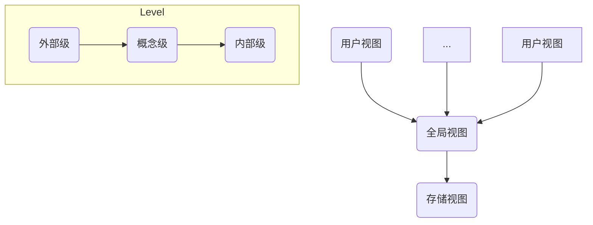
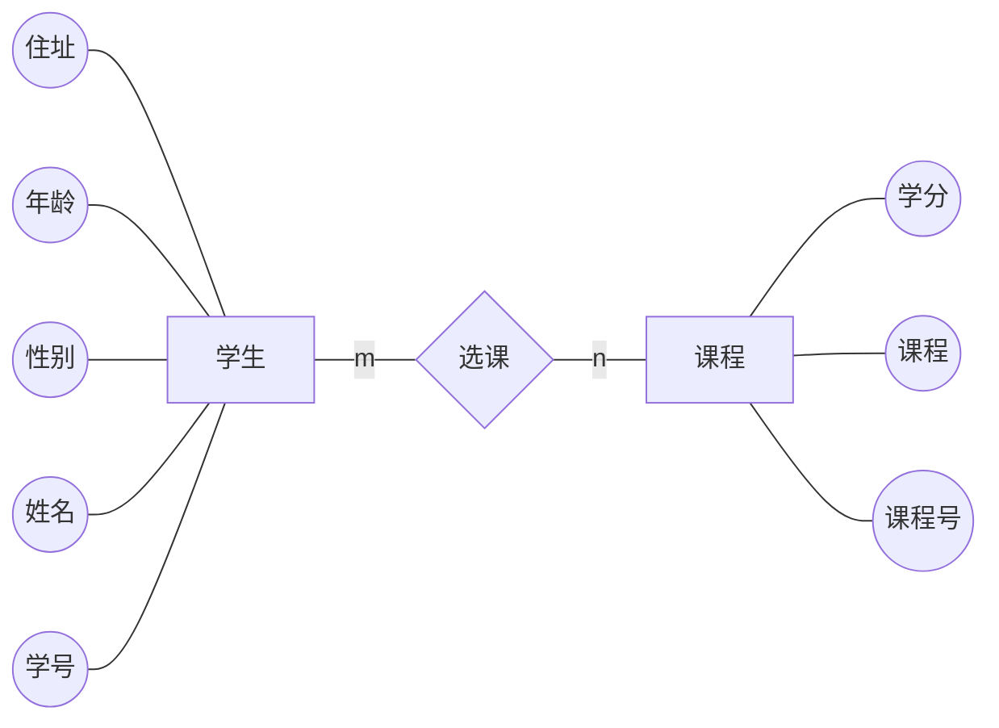
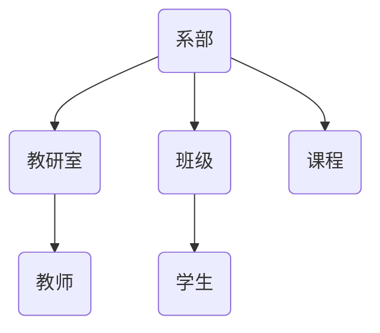
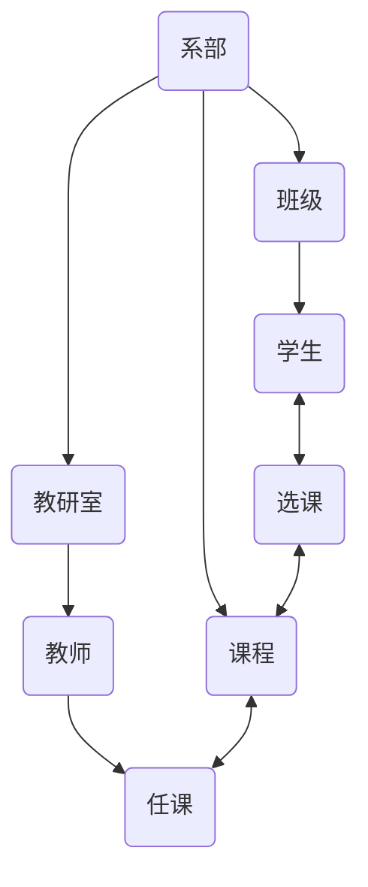

# Chapter1 Basic knowledge

> Before we learn, we need to make a brief introduction to the structure of database, to learn some basic conception like DBS, DBMS, DB.

## 1. Conception 

### 数据

> **数据是反应客观事物属性的记录，是信息的具体表现形式。**人们常用各种各样的物理符号来表示客观事物的特性和特征，这些符号及其组合就是数据。
> 任何事物的属性都是通过数据来表示的，这些数据经过加工成为信息，而信息必须通过数据才能传播，才能对人类产生影响。

### 数据处理

> **数据处理也称为信息处理，就是计算机对数据进行输入、输出、整理、存储、分类、排序、检索、统计等加工过程。**数据处理的对象包括数值、文字、图形、表格等。

### 数据库

> **数据库(DB)就是数据存储的仓库。**数据库由两部分组成：一是应用所需要的数据的集合，成为物理数据库，它是数据库的主体；二是关于各级数据结构的描述，由数据字典系统管理。

### 数据模型

> 为了有效地实现对数据的管理，必须使用一定的结构来组织、存储数据，并且需要一种方法来建立各种类型数据之间的联系。我们把**表示实现类型及实体之间联系的模型称为数据模型**，包括关系模型、层次模型和网状模型等。

### 数据库管理系统

> 数据库管理系统(DBMS)是数据库系统中对数据进行管理的专门的软件系统，它是数据库系统的核心部分，对数据库的所有操作和控制都是通过DBMS来实现的。

### 数据库应用系统

> 数据库应用系统是在某种DBMS的支持下，根据实际应用的需要开发出来的应用程序包。

### 数据库系统

> **数据库系统(DBS)是硬件系统、DB、DBMS、数据库应用系统、数据库管理员和用户的统称。**


## 2. Features

> + 数据共享性高、冗余度小、易扩充；
>
> + 采用特定的数据类型；
>
> + 数据独立性高；
>
> 	数据的独立性包括物理独立性和逻辑独立性。物理独立性指当数据的物理存储改变时，应用程序不用改变。逻辑独立性指当数据的逻辑结构改变时，用户应用程序不用改变。
>
> + 统一的数据管理和控制
>
> 	数据库对于系统中的用户是共享资源的，计算机的共享一般是并发的，甚至可以同时存取数据库的同一个数据。因此数据库管理系统必须提供以下的数据控制保护功能：*数据的安全性保护、数据的完整性保护、数据库恢复、并发控制*。


## 3. Structure

数据库的体系结构分为3级：**外部级（用户视图）、概念级（全局视图）和内部级（存储视图）**。

从不同角度看到的数据特征称为数据视图。用户所看到的数据特征属于外部级，单个用户使用的数据视图称为外模型；而涉及用户的数据定义，也就是全局的数据视图，称为概念模型；涉及实际数据存储方式最接近存储的物理设备的数据视图，称为内模型。




## 4. Data Model

数据模型是用来抽象表示和处理现实世界中的数据和信息的工具，是反映客观事物级客观事物之间联系的数据组织的结构和形式。

在数据库技术中，可用数据模型描述数据的整体结构，包括数据的结构和性质、数据之间的联系、完整性约束及数据变换规则。数据模型应该结构简单，易于在计算机上实现，而且能够比较真实地反映客观事物之间的联系。

数据模型可分为两种形式：**概念模型**和**实现模型**。通常先将现实世界中的一个系统抽象为概念模型，它既不依赖于具体的DBMS，然后把概念模型转换为与某一个具体DBMS相关联的数据模型，即实现模型。在实际生活中，数据模型是指实现模型。

### 4.1 Conception Model

> 概念模型是现实事物之间的一种抽象，它表示数据的逻辑特征，从概念上表示数据库中将要存储的信息，而不涉及这些信息在数据库中的存储形式。最常见的概念模型是实体-联系模型(Entity-Relationship)图，简称E-R图。

#### (1) 实体

实体是指客观存在的并相互区别的事物。

#### (2) 属性

属性是指实体具有的特性。

#### (3) 实体型和实体集

用实体名及其属性名集合来抽象和刻画同类实体，称为实体型。

同类型实体的集合称为实体集。

#### (4) 实体间的联系

实体与实体之间的联系称为实体间的联系。包括一对一联系、一对多联系、多对多联系。

#### (5) 实体-联系模型

实体-联系模型是反映实体之间联系的结构形式，简称E-R模型。描述E-R模型通常用E-R图，E-R图提供了实体型、属性和联系的方法。

E-R图包括以下三个要素：

> + 实体型：用矩形表示，矩形框内写明实体名；
> + 属性：用椭圆形表示，并用直线和相关实体连接；
> + 联系：用菱形表示，框内写明联系名，用直线与相关实体相连，同时著名联系类型。



<center />E-R图

### 4.2 实现模型

> **为了反映现实世界中的客观事物本身及其与其他事物之间的联系，数据库中的数据必须具有一定的结构，这种结构就是实现模型，也统称为数据模型（更多叫基本数据模型，与其父类不同）。**数据模型是数据之间逻辑关系的一种反映。

数据模型分为3类：层次模型、网状模型和关系模型。

#### (1) 层次模型

> 层次模型是数据库中最早出现的数据模型，层次数据库系统采用层次模型作为数据的组织方式。用树型（层次）结构表示实体类型及实体间的联系是层次模型的主要特征。

在数据库中，层次模型具有树结构（非线性数据结构）的基本特点，因此层次模型具有层次清楚、结构简单、易于实现，能够描述一对一和一对多的联系。



<center/>层次模型示例

#### (2) 网状模型

在现实世界中事物之间的联系更多的是非层次关系，用层次模型表示非树形结构是很不直接的，网状模型则可以克服这一弊端。

用网状结构表示实体类型及实体之间联系的数据模型称为网状模型。网状模型是层次模型的扩展，表示多个从属关系的层次结构，网状模型的节点间可以任意发生关系，能够表示各种关系。其节点满足以下条件：

> 1）允许节点拥有超过一个父节点；
>
> 2）允许一个以上的节点无父节点（即多个根节点）； 

网状结构可以表示较复杂的数据结构，即可以表示数据间的横向和纵向关系。网状结构可以多用于多对多的联系。




#### (3) 关系模型

关系模型是目前最常用的一种数据模型。关系模型系统采用关系模型作为数据的组织方式。  

现实世界中人们常用表格形式来表示数据信息。但是日常生活中使用的表格往往比较复杂，在关系模型中基本数据结构被限制为二维表格。因此，在关系模型中，数据在用户观点下的逻辑结构就而是一张二维表。每一张二维表都被称为关系。

| 学号    | 姓名   | 性别 |
| ------- | ------ | ---- |
| 1161001 | 李伯任 | 男   |
| 1161002 | 陈晴   | 男   |
| 1161003 | 马大大 | 男   |
| 1161004 | 夏小雪 | 女   |
| 1161005 | 钟大成 | 女   |

<center/>学生表


## 5. Relation Database

### 5.1 Basic Conception

#### (1) 关系

> 一个关系就是一个二维表，每个关系都有一个关系名，常常表现为表的名字。

#### (2) 元组

> 在一个二维表中，表中的行称为元组，每一行都是一个元组（也称为一个实体），元组对应表中的每一条记录。

#### (3) 字段

> 每一列称为一个字段，列首称为字段名，字段名以下的的单元格中的数据称为字段值，同一列的字段值具有相同的属性（即数据格式大小等）。

#### (4) 记录

> 每一行称为一个记录或者一个元组，也就是关系的“值”。同一个记录中的各字段值都是相互有关的。

#### (5) 域

> 属性的取值范围称为域，即不同的元组对同一属性的取值所限定的范围。

#### (6) 属性

> 属性是数据的特性，如类型、长度等。

#### (7) 主键

> 其值能唯一地标识表中每条记录的字段。主键可以是一个字段，也可以是多个字段的组合。
>
> 主键是用于在某个表中域其他表中外键建立关系，快速查找并组合存储在各个表中的信息，进行分类、筛选和统计等。
>
> **在数据库中，主键的值既不允许重复，也不允许空值的存在，而且必须始终有唯一索引。**

#### (8) 外键

> 一个表中的某个（或多个）字段是另一个表的主键，这个字段就被称为外键。外键用于建立表与表之间的关系。


### 5.2 Relation Calculation

> 在关系数据库进行查询时，需要找到用户感兴趣的数据，这就需要对关系进行一定的运算。关系的基本运算有两类：一类是传统的集合运算（并、差、交），另一类是专门的关系运算（选择、投影、连接），有时查询需要几种基本运算的组合。

#### 5.2.1 选择运算

> **从选择中找出满足给定条件的那些元组称为选择。**其中条件是由逻辑表达式给出的，值为真的元组将被选出。这种运算是从水平方向抽取元组。

```SQL
LIST FOR 出版单位=“高等教育出版社” AND 单价 <= 20
```

#### 5.2.2 投影运算

> **从关系模式中挑选若干属性组成新的关系称为投影。**这是从列的角度进行的运算，相当于对关系进行垂直分解。

```SQL
LIST FIELDS 单位，姓名
```

#### 5.2.3 连接运算

> 连接是将两个关系模式通过公共的属性名拼接成一个更宽的关系模式，生成的新关系包含满足连接条件的元组。运算过程是通过连接条件来控制的，连接条件中将出现两个关系中的公共属性名，或者具有相同语义、可比的属性。连接是对关系的结合。

#### 5.2.4 自然连接

> 自然连接是去掉重复属性的等值连接。它属于连接运算中的一个特例，是最常用的连接运算，在关系运算中起着重要作用。


### 5.3 Integrity of the relationship

关系的完整性规则是对关系的某种约束性条件，以保证数据的正确性、有效性和相容性。关系模型中有3类完整性约束：

> + **实体完整性**：实体完整性规则要求关系中的主键不能取空值或重复的值；
> + **参照完整性**：对数据库中建立关联联系的数据表间数据参照引用的约束，也就是对外键的约束。准确地说，指关系中的外键必须是另一个关系的主键有效值。
> + **域完整性**：域是逻辑相关的值的集合，从域中可以得到特定的列的值，域的完整性是指列输入数据的有效性，即输入的数据都应该包含在域内。


## 6. Database Design

概括起来，数据库设计包括两方面：**数据库的结构设计**与**数据库应用系统的功能设计**。（有点像前后端设计）

**数据库的结构设计，就是建立一组结构合理的基表，这个是数据库的数据源。**必须合理地规划，有效地组织数据，以便实现高度的数据集成和有效的数据共享。基表应该满足关系规范化的原则，尽可能减少数据冗余，保证数据的完整性和一致性。

数据库应用功能的设计，是在充分进行用户需求分析的基础上来实现的，它包括各种用户界面的设计和功能的实现策略。

除了必要的硬件选择和建立外，还必须选择一个合适的软件，即DBMS.

### 6.1 Data Normalization

> 数据规范化属于数据库设计理论范畴，此处只做简单介绍。
>
> 在数据库中，基表必须满足规范化的原则，即是一个二维表。对二维表最通俗的解释是，每个字段必须是原子的、不可再分的，每一行就是一个记录，行与行之间不存在组合。
>
> 由于数据之间不同的特点和相互依赖关系，在数据操作时会遇到各种问题。为此，标准的规范化格式分为5种，一般只需要前三种，后两种第五第七范式只有在关系规范化研究较深时才会用到。

#### (1) 第一范式 (1NF)

> 每个字段必须树原子的、不可再分的。这是最基本的要求。

#### (2) 第二范式 (2NF)

> 首先，必须满足第一范式，并且不存在非主键对主键的部分函数依赖。也就是说，所有的非主键都完全函数依赖于主键，不存在只与主键中的部分属性的函数依赖。

#### (3) 第三范式 (3NF)

> 首先，必须满足第二范式，并且不存在非主键对主键的传递函数依赖。也就是说所有的非主键都之间函数依赖于主键，不存在间接地函数依赖于主键。

函数依赖即指主键与非主键之间存在某种直接的关连，可以用函数表征。而传递函数依赖是指主键于非主键之间可以通过第三键相关联，可以用函数表征。

---

###  6.2 Development and design 

> 数据库应用系统的开发与设计使用软件工程的理论与方法作为指导。软件工程把应用系统的开发过程描述为软件生命周期，这个周期分为**用户需求分析、应用系统设计、设计的实现（编码）、应用系统测试、系统运行和系统维护**。

#### 6.2.1 用户需求分析

在整个软件生命周期中，这个阶段是至关重要的，必须充分了解用户的需求，包括业务流程、数据流向等，才能设计出符合客观需要的优秀软件。这要分为以下内容的调查与分析：

##### (1) 业务流程分析

> 充分了解用户的业务流程、业务之间的联系，确定他们之间相互关联的方法，为功能设计建立良好的依据。

##### (2) 数据流向分析

> 充分了解数据的原始来源，中间经过哪些处理环节，它们之间有哪些联系，包括输入输出及反馈等流向，为数据库的设计奠定基础。

##### (3) 系统功能分析

> 通过分析、归纳用户的业务过程，理出各个环节的关系，制定出解决问题的方案，画出 E-R图。

#### 6.2.2 应用系统设计

在完成了需求分析后，就可以进入应用系统设计阶段，它包括以下几个环节：

##### (1) 数据库结构设计

> 数据库结构设计是非常关键的一步，他将决定整个应用系统的数据源的组织、结构是否合理，关系到系统的工作效率和质量。数据库结构设计包括基表的结构设计、建立数据模型以及设计表与表之间的关联方法，设计时要遵循数据规范化的原则。

##### (2) 应用系统的功能设计

> 在这一步的工作中，应根据需求完成各个功能的详细设计，建立各个模块之间的联系方法，按照规范设计。

##### (3) 用户界面设计

> 用户界面设计包括输入模块和输出模块的设计，人机交互界面设计等；
>
> 输入模块要求美观、操作方便，并要保证整体风格同意，输出模块包括显示和打印两个模块的设计，人机交互界面包括流程的控制面板设计和对话框设计。

#### 6.2.3 设计的实现（编码）

编码实现功能，技术上要对可能发生的错误进行防范，提高抗干扰能力，还要增加一些容错技术等。 

#### 6.2.4 应用系统测试

对软件的测试首先要完成对单个模块的测试，然后进行多个模块之间的整体连调，包括功能的测试和性能的测试。

#### 6.2.5 系统运行和系统维护

测试完毕后就可以进行投入试运行了，但不代表没有问题，任何一个优秀的软件都是在不断的运行中不断发现问题、解决问题、克服不足、逐渐完善的，这是一个必不可少的过程。


# Chapter2 Access Synopsis

## 1. Database Object

在Access2010中，**数据库包括6个基本对象，即表、查询、窗体、报表、宏、模块。**

每个对象在数据库中国的作用和功能也不同。当打开一个数据库时，数据库的所有对象都可以在导航窗格显示出来。所有数据库对象都保存在扩展名为 `.accdb` 的同一个数据库文件中。

> ***注：Access语句对大小写不敏感。***

### 表

> 表也称为基表，它是数据库中最基本的数据源，是信息的仓库，是信息数据处理的基础和依据。一个数据库可以包含多个表，每个表都是由规范化的数据以一定的结构组织起来的，且表与表之间既有独立性，又存在一定的联系，可以通过某种方式定义它们之间的关系。

### 查询

> 查询时对基表数据有选择地提取而产生的另一类的对象，以便提高数据处理的效率。一个查询产生的结果可以是另一个表中的部分字段信息，数据库操作中称为"投影"；也可以是表中满足条件的部分记录，数据库操作中称为“筛选”；还可以是来自多个表的部分或全部信息，数据库中操作称为“连接”。查询不仅可以根据需要选择基表中的数据，还可以根据需要进行排序、统计、计算等操作。因此，查询可以方便用户，提高数据处理的效率。
>
> 这种查询属于对表得信息检索的类型，它的特点是不改变原表中的原始数据。另一类查询称为“操作查询”，它包括“删除”、“更新”、“生成表”等操作，此类查询操作会导致原始表数据发生变化。

### 窗体

> 窗体是重要的人机交互界面，是用户和 Access 之间的接口。设计者可以利用窗体为用户提供友好的界面，供用户浏览和修改表中的数据。由于 Access 的窗体设计非常方便灵活，因此设计者可以充分发挥之间的创意，展现自己的个性和才华，使得 Access 应用体系具有独有的整体风格，既接近实际应用又高于实际应用，使用户能够轻松愉快、方便快捷地对数据库进行各种操作。

### 报表

> 报表是 Access 提供的另一种输出形式，主要作用是从打印机上输出。一般来说，对数据库信息的输出，如果只需要查看内容或计算结果，使用窗体就可以了。如果要打印出各种表格，并对数据进行分类、分组等处理，使用报表是最好的选择。
>
> 报表的数据源来自表或查询，报表中数据的计算非常方便，Access 提供了丰富的函数，包括各种日期函数、页统计、统计函数等，这些函数的计算值都被存储在报表对象中。

### 宏

> 宏是命令的集合。命令实际上是一段简单的小程序，每个命令实现一个特定的操作。Access 提供了40多种宏命令。Access 宏可以只包括一个宏命令，也可以包括多个宏命令，还可以根据条件执行其中的某些宏命令，但是宏只能用于执行一些简单的操作，不能处理复杂的过程。

### 模块

> 模块也称程序，是比宏更大更复杂的程序。它能够处理更多的事务，处理各种复杂情况和执行相应的过程。随着数据库中数据量的不断增加，用户对管理信息系统的要求越来越高，仅仅靠宏命令是远远不够的，要编制出高质量的功能强大的应用程序，必须使用模块来实现。
>
> Access 中嵌入了数据库编程语言 VBA ，也可以外挂动态网页动态设计语言 ASP。模块中的每一个过程都可以是一个函数过程或者子程序。 


## 2. Create Database

在 Access 中创建数据库通常有两种方法：一种是利用 Access 向导创建数据库，另一种是直接创建空数据库。具体的省略。


# Chapter3 Data Sheet

> 在建立数据库的基础上，本章主要介绍数据库中数据表的创建和编辑方法、记录的输入操作、常用字段属性的设置、数据的排序和筛选、表与表之间的关系等。

## 1. Create

> 表在数据库中用来存储数据的对象，是整个数据库的基础，也是数据库中其他对象的数据来源。

## 2. Data type

| 数据类型  | 说明                                                         |
| --------- | ------------------------------------------------------------ |
| 文本      | 这种类型允许最大**255**个字符或数字，即120多个汉字，可以对文本字段进行排序和索引。 |
| 备注      | 这种类型用来保存长度较长的文本及数字，它允许字段能够存储长达65535个字符的内容。**但 Access *不能对备注字段进行排序或索引*，却在备注字段中虽然可以搜索文本，但却不如在有索引的文本字段中搜索得快。** |
| 数字      | 这种字段类型可以用来存储进行算术计算的数字数据.用户还可以设置“字段大小”属性定义一个特定的数字类型，任何指定为数字数据类型的字型可以设置成“字节”、“整数”、“长整数”、“单精度数”、“双精度数”、“同步复制ID”、“小数”五种类型。在Access中通常默认为“双精度数”。 |
| 日期/时间 | 这种类型是用来存储日期、时间或日期时间一起的，每个日期/时间字段需要**8**个字节来存储空间。 |
| 货币      | 这种类型是数字数据类型的特殊类型，**等价于具有*双精度属性*的数字字段类型**。向货币字段输入数据时，不必键入人民币符号和千位处的逗号，Access会自动显示人民币符号和逗号，并添加两位小数到货币字段。*当小数部分多于两位时，Access会对数据进行四舍五入。* |
| 自动编号  | 这种类型较为特殊，每次向表格添加新记录时，Access会自动插入唯一顺序或者随机编号，即在自动编号字段中指定某一数值。自动编号一旦被指定，就会永久地与记录连接。如果删除了表格中含有自动编号字段的一个记录后，Access并不会为表格自动编号字段重新编号。**当添加某一记录时，Access不再使用已被删除的自动编号字段的数值，而是重新按递增的规律重新赋值。** |
| 是/否     | 这种字段是针对于某一字段中只包含两个不同的可选值而设立的字段，通过是/否数据类型的格式特性，用户可以对是/否字段进行选择。 |
| OLE对象   | 这个字段是指字段允许单独地“链接”或“嵌入”OLE对象。添加数据到OLE对象字段时，可以链接或嵌入Access表中的OLE对象是指在其他使用OLE协议程序创建的对象。OLE对象字段最大可为1GB，它主要受磁盘空间限制。 |
| 超级链接  | 这个字段主要是用来保存超级链接的，包含作为超级链接地址的文本或以文本形式存储的字符与数字的组合。当单击一个超级链接时，WEB浏览器或Access将根据超级链接地址到达指定的目标。超级链接最多可包含三部分：一是在字段或控件中显示的文本；二是到文件或页面的路径；三是在文件或页面中的地址。在这个字段或控件中插入超级链接地址最简单的方法就是在“插入”菜单中单击“超级链接”命令。 |
| 查阅向导  | 这个字段类型为用户提供了一个建立字段内容的列表，可以在列表中选择所列内容作为添入字段的内容。 |

### Float and Int

| **数字** | **说明**                                                     | **小数精度** | **存储空间大小** |
| -------- | ------------------------------------------------------------ | ------------ | :--------------- |
| **字节** | 存储 0 到 255 之间的整数。                                   | 无           | 1 个字节         |
| 整型     | 存储 $ \pm2^{15} $ 之间的整数                                | 无           | 2 个字节         |
| 长整型   | （默认）存储 $ \pm2^{31} $ 之间的整数                        | 无           | 4 个字节         |
| 小数型   | 存储 $–10^{38}$ 到 $10^{38}$ 之间的数字 (.adp)<br />存储 $–10^{28}$ 到 $10^{28}$ 之间的数字（.mdb、.accdb） | 28           | 2 个字节         |
| 单精度型 | 存储 $–3.402823e^{38}$ 到 $3.402823e^{38}$ 之间的数。        | 7            | 4 个字节         |
| 双精度型 | 存储 $–1.797e^{308}$ 到 $1.797e^{308}$ 之间的正数。          | 15           | 8 个字节         |
> **注意：字节型而不是小整数，更不是字符。**


## 3. Tuple attribute

| Attr     | Description                                                  |
| -------- | ------------------------------------------------------------ |
| 字段大小 | 数据最大长度                                                 |
| 格式     | 用于自定义文本、数据、日期和时间类型字段的输出格式           |
| 输入掩码 | 输入数据格式化，具体的格式符如下，可用于数字、货币、日期/时间以及（短）文本。 |
| 标题     | 窗体显示文本，若无，则显示为字段名。                         |
| 默认值   | 默认值是新增记录时该字段的默认内容，以减少输入量，同时默认值是可修改的 |
| 验证规则 | 用于指定对输入的要求                                         |
| 验证文本 | 当输入数据不满足验证规则时弹出的窗体文本信息                 |
| 必需     | 是否是必须填写的属性                                         |
| 索引     | 索引可以加速对索引字段的查询，还能加速排序以及分组操作       |
| 文本对齐 | 文本对齐方式                                                 |


## 4. Input mask

输入掩码格式符：

| **字符**    | **说明**                                                     |
| ----------- | ------------------------------------------------------------ |
| 0           | 用户必须输入一个数字（0 到 9）。                             |
| 9           | 用户可以输入一个数字（0 到 9）。                             |
| #           | 用户可以输入一个数字、空格、加号或减号。 如果跳过，Access 会输入一个空格。 |
| L           | 用户必须输入一个字母。                                       |
| ?           | 用户可以输入一个字母。                                       |
| A           | 用户必须输入一个字母或数字。                                 |
| a           | 用户可以输入一个字母或数字。                                 |
| &           | 用户必须输入一个字符或空格。                                 |
| C           | 用户可以输入字符或空格。                                     |
| . , : ; - / | 小数分隔符、千位分隔符、日期分隔符和时间分隔符。 您选择的字符取决于 Microsoft Windows 区域设置。 |
| >           | 其后的所有字符都以大写字母显示。                             |
| <           | 其后的所有字符都以小写字母显示。                             |
| !           | 导致从左到右（而非从右到左）填充输入掩码。                   |
| \           | 逐字显示紧随其后的字符。                                     |
| ""          | 逐字显示括在双引号中的字符。                                 |

## 附：ANSI-89 通配符

使用“**查找和替换**”对话框查找并根据需要替换 Access 数据库或 Access 项目中的数据时，使用此通配符集。 还可以在对 Access 数据库运行选择和更新查询时使用这些通配符，但不能用于对 Access 项目运行查询。

| **字符** | **说明**                                                    | **示例**                                |
| -------- | ----------------------------------------------------------- | --------------------------------------- |
| *        | 匹配任意字符数                                              | “**wh\***”将找到 what、white            |
| ?        | 匹配任意单个字母字符                                        | “**B?ll**”可以找到 ball、bell 和 bill。 |
| [ ]      | 匹配括号中的任意单个字符                                    | “**B[ae]ll**”可以找到 ball 和 bell      |
| !        | 匹配括号中不包含的任意字符                                  | “**b[!ae]ll**”可以找到 bill 和 bull     |
| -        | 匹配字符范围中的任意一个字符。 <br />但必须以升序指定该范围 | “**b[a-c]d**”将找到 bad、bbd 和 bcd     |
| #        | 匹配任意单个数字字符                                        | “**1#3**”将找到 103、113 和 123         |

> ***注：不同于标准的正则表达式通配符。***


## 4. Select 

> 筛选是选择查看记录，不改变原始数据。筛选时用户必须设定筛选条件，然后 Access 显示满足条件的数据，不满足条件的数据将被隐藏。筛选可以使得数据更加便于管理。Access提供了三种筛选发生：选择筛选、按窗体筛选和高级筛选。

### 4.1 Select filter

> 选择筛选用于查找**某一个字段**满足条件的数据记录，条件包括“（不）等于”和“（不）包含”等，其作用是隐藏不满足条件的记录，显示所有满足条件的记录。

选择筛选可以直接再开始选项版筛选工具栏中选择功能直接使用。

### 4.2 Form select

> 按窗体筛选是在空白窗体中设置筛选条件，然后查找满足条件的所有记录并显示，可以在窗体中设置**多个条件**，按窗体筛选是使用最广泛的一种筛选方法。

### 4.3 Advanced select

> 高级筛选不仅可以筛选满足条件的记录，还可以对筛选结果进行**排序**。


## 5. Index

索引可以**加速**对索引字段的**查询**，还能加速排序集分组操作。当表数据量很大时，为了提高查找速度，可以设置索引属性。索引属性有以下3个项选取：

> + “无”：表示本字段无索引，且改字段的记录可以重复；
> + “有（有重复）”：表示本字段有索引，且该字段中的记录可以重复；
> + “有（无重复）”：表示本字段有索引，且该字段中的记录不允许重复；

一般情况下，作为主键字段的索引属性为“有（无重复）”，其他字段的索引属性为“无”。

# Chapter4 Query

> 查询时基于“表”的一种视图，通过查询所看到的记录，实际上是存储在表中的数据，不需要额外的空间来存储他们，而只是对它们进行重新组合、聚集、统计的加工处理后得到的另一种视图。利用查询可以实现对数据库中的数据进行浏览、筛选、排序、检索、统计等加工操作。

## 1. Synopsis

利用数据表可以存储数据，这些数据可以长期保存于数据库中。存储数据时为了重复使用这些数据。在设计数据库时，为了减少数据冗余，节省内存空间，常常会将数据分类存储到多个数据表中，这种设计导致某些相关信息分散地存储在多个数据表中。在使用这些数据时，用户可以根据自己的需求从单个数据表中获取需要的数据，也可以从多个相关的数据表中获取信息，这是所要采用的功能就是查询功能。

### 1.1 Conception

查询是指向数据库提出请求，使数据库按照特定的需求在指定的数据源中进行查找，以提取特定的字段，**返回一个新的数据对象**，这个对象就是查询结果。查询是数据库中的一个重要对象，具有以下功能：

> *(1) 选择字段和记录;* 查询可以根据给定的条件查找并显示相应的记录，也可以仅显示需要的字段；
>
> *(2) 修改记录；* 通过查询功能可以对符合条件得记录进行添加、修改、删除等操作；
>
> *(3) 统计和计算；* 可以使用查询对数据进行统计和计算；
>
> *(4) 建立新表；* 可以将查询所得得动态记录存储于表中；
>
> *(5) 为其他数据库对象提供数据源；* 在创建报表、窗体或数据访问页时，其数据源可能时多个表，在这种情况下，可以先建立一个查询，再以查询作为一个数据源设计报表等；

> **Tip：**查询与筛选不同，筛选可能会返回一个窗体对象，而查询返回一个查询对象。

---

### 1.2 Type

根据对数据源的操作方式以及查询结果，Access 2010 提供的查询可以分为5中类型，分别是选择查询、交叉表查询、参数查询、操作查询和 SQL 查询。

> #### (1) 选择查询
>
> 选择查询是最常见的查询类型，它能根据用户指定的查询条件，从一个或多个数据表中获取数据并显示结果，还可以利用查询条件对记录进行分组，并进行求和、计数、平均数等运算。选择查询产生的结果是一个动态记录集，不会改变数据表中的数据。
>
> #### (2) 交叉表查询
>
> 交叉表查询可以计算并重新组织数据表的结构，可以方便地分析数据。交叉表查询将源数据或查询中的数据分组，一组在数据表的左边，另一组在数据表的上部，数据表内行与列的交叉单元格处显示表中数据中的某个统计值，这是一种可以将表的数据看成字段的查询方。
>
> #### (3) 参数查询
>
> 参数查询为用户提供了 更加灵活的查询方式，可以通过参数来设计查询的准则，在执行查询时，会出现一个已经设计好的对话框，由用户输入查询条件并根据此条件返回查询结果。
>
> #### (4) 操作查询
>
> 操作查询是指在查询中对源数据表进行操作，可以对表中的记录进行追加、修改、删除和更新操纵，操作查询包括删除查询、更新查询、追加查询和生成表查询。 
>
> #### (5) SQL查询
>
> SQL 查询是指使用结构化查询语言 SQL 创建的查询。 在 Access 种用户可以使用查询设计器创建查询，在查询创建完成后，系统会自动生成一个对应的 SQL 语句，除此之外，用户还可以使用 SQL 语句创建查询，实现对数据的查询和更新操作。

---

### 1.3 Query View

查询一共有五种视图，分别是设计视图、数据表视图、SQL 视图、数据透视表视图和数据透视图视图。

> + **设计视图**：查询设计器，通过该视图可以创建除 SQL 之外的各种类型查询；
> + **数据表视图**：数据表视图是查询数据浏览器，用于查看查询运行结果；
> + **SQL 视图**：SQL 视图时查看和编辑 SQL 语句的窗口，通过该窗口可以查看用查询设计器创建的的查询所产生的 SQL 语句，也可以对 SQL 语句进行编辑和修改。
>
> + **数据透视表视图和数据透视图视图**：在数据透视表视图和数据透视图视图种，可以根据需要生成数据透视表和数据透视图从而对数据进行分析，得到直观的分析结果。

---
### 1.4 Create

在 Access 中，创建查询的方法主要有两种，有使用查询设计视图创建查询和使用查询向导创建查询。

> (1) **使用查询设计视图**：打开创建选项卡，查询工具栏，选择查询设计功能，然后根据需要进行查询创建； 
>
> (2) **使用查询向导**：同上，创建查询向导，然后根据系统的引导完成创建；


## 2. Select query

> 选择查询是最常用的查询类型，它能根据用户指定的条件，从一个或多个数据表中获取的数据并显示结果，还可以利用查询数据条件对记录进行分组，并进行求总和、计数、平均值等运算。选择查询生成的结果是一个动态的的记录集，不会改变源数据表中的数据。

### 2.1 Create

创建选项栏，按照创建向导即可，具体操作省略。

### 2.2 Condition

在查询时往往需要表达我们所需要的条件，在设计视图中，查询是条件是通过设计视图中的条件栏输入 Access 表达式来是实现的。

此外，若要表达多个条件，在设计网格中，同一行表示“与”的关系，不同行表示“或”的关系，也可以用逻辑表达式来表达两个以上的条件。同时，表达条件是，两段的引号不必输入，系统会自动添加。

### 2.3 Sum in group

Access 查询中，除了可以从字段列表中选择所需的字段外，还可以建立新的字段，这个字段内容是基于其他字段的表达式。 Access 查询提供了利用函数建立总计查询的方式，总计查询可以对查询中的某列进行总和、平均、计数、最小值等运算。


## 3. Parameter query

在实际应用中，查询条件是我们事先不知道，由用户指定的，这一类需要用户输入条件作为参数的查询称为参数查询。参数查询根据参数数量分为单参数查询与多参数查询，此处对于具体的操作不做介绍。

### 3.1 Single select

单参数的查询主要是通过方括号对来事先的，括号中的内容自定义的用来作为提示信息的文字，其内容只要能够使最终用户明白要求即可。系统对于“条件”中出现的放括号对，一般会弹出输入框，然后将输入的内容作为条件加以执行。

### 3.2 Multiple

多参数查询在要用在参数的每个字段下的“条件”航中输入条件表达式，并在放括号输入相应的提示信息。


## 4. Crosstab query

交叉表查询通常以一个字段的值作为表的行标题，以另一个表的字段的值作为列标题，在行和列的交叉点单元格处获得数据的汇总信息，以达到数据统计的目的。交叉表查询是查询的另一种类型，用于**解决一对多关系，对“多方”实现分组求和**。

具体操作在创建查询向导处选择交叉表查询向导，随后根据向导提示完成创建。


## 5. Operate query

前面几类查询都不会改变源数据，它们属于选择查询。而操作查询则会对源数据进行操作，因此需要慎重操作，同时与选择查询不一样，操作查询不会实时显示操作结果，而是需要通过进入目标表查看。

操作查询根据操作类型分为四种：生成表查询、更新查询、追加查询和删除查询，**操作查询不能通过查询向导生成**。

> **1) 生成表查询**：根据一个或多个表中全部数据或部分数据创建一个新表，运行生成表查询即可生成一个新表；
>
> **2) 更新查询**：对一个或多个表中符合条件的一组记录作更新；
>
> **3) 追加查询**：从一个或多个表中将符合条件的记录添加到另一个表的尾部；
>
> **4) 删除查询**：从一个或多个表中删除一组符合条件的记录；


## 6. SQL query

> Access 中每一个查询都对着一个 SQL 查询命令，当用户使用查询向导或查询设计器创建查询时，系统会自动生成对应的 SQL 查询命令，可以在 SQL 视图中查看，除此之外还可以直接通过 SQL 视图输入 SQL 命令创建查询。

### 6.1 Synopsis

SQL 是结构化语言( Structured Query Language)的简称。它是一种通用的关系数据库的数据处理语言，在许多种类的数据库中都可以使用，具有较好的开放性、可移植性和可扩展性。以下是SQL实现基本功能的动词：

| SQL 功能 | 动词                   |
| -------- | ---------------------- |
| 数据定义 | CREATE、DROP、ALTER    |
| 数据操作 | INSERT、UPDATE、DELETE |
| 数据查询 | SELECT                 |
| 数据控制 | GRANT、REVOKE          |

> **Attention: Use “;” to sperate each command!**

### 6.2 Main feature

> 1) SQL 是一种*一体化语言*，它包括了**数据定义、数据查询、数据操作和数据控制**等方面的功能，可以完成数据库活动中的全部工作；
>
> 2）SQL 是一种高度的*非过程化语言*，它只需要描述“做什么”而不需要说明“怎么做”；
>
> 3）SQL 是一种非常*简单*的语言，他使用的语句很接近自然语言，易于学习和掌握；
>
> 4）SQL 是一种*共享*语言，它支持客户机/服务器（C/S）模式。


### 6.3 Data definition

> Access 中 SQL 语言的数据定义功能包括定义白哦和定义索引，具体是指创建、修改和删除表和索引，此处仅涉及表相关的操作。

#### 1. Sheet create

```SQL
CREATE TABLE <TABLENAME> ([COLUMN1] COLUMNTYPE[<COLUMN_Integrity_Constraint>], [COLUMN2] COLUMNTYPE[<COLUMN_Integrity_Constraint>][...])
```

#### 2. Modify sheet structure

```SQL
ALTER TABLE <TABLENAME>
ADD <COLUMN_NAME> <DATATYPE> [<COLUMN_Integrity_Constraint>] ... 
ALTER <COLUMN_NAME> <DATATYPE> ...
DROP <COLUMN_NAME> <DATATYPE> ...
```

#### 3. Delete table

```SQL
DROP TABLE <TABLENAME> ...
```

#### Example

```sql
CREATE TABLE student
(
学号 char(10) NOT NULL,
姓名 char(12) NOT NULL,
性别 bit,
专业 char(15)
)
;
ALTER TABEL student
ADD 入学时间 DATE；
DROP TABLE student;
```


### 6.4 Data control

#### 1. Data update

该功能能用表达式的值更新指定表中列的值。

```sql
UPDATE <TABLE_NAME> SET <COLUMN_NAME>=<EXPRESS>[,...][WHERE <CONDITION>]
```

式中`<COLUMN_NAME>=<EXPRESS>`是用表达式中的值更新列的值，`WHERE`语句用于筛选条件，指定记录应该满足的条件。

---

#### 2. Data insert

该功能能将一个新的记录插入指定的表中。

```sql
INSERT INTO <TABLE_NAME>[(COLUMN1,...)] VALUES (VALUE1,...)
```

---

#### 3. Data delete

该功能能将满足条件的记录删除，如果省略条件，则默认删除全部数据，但是不该表原有结构。

```sql
DELETE FROM <TABLE_NAME> WHERE <CONDITION>
```

---

#### Example

```sql
UPDATE 课程表 SET 学分=学分+1;
INSERT INTO 学生表[(学号,性别)] VALUES (“0000”,“男”);
DELETE FROM 学生表 WHERE 学号="0000"
```


### 6.5 Data query

该功能能根据条件选出符合条件的记录并形成查询结果。

```sql
SELECT [*] [<TABEL>].<COLUMN> ...
	FROM <TABLE>
	[WHERE ...]
	[GROUP BY ...]
	[ORDER BY ...]
	[SELECT ...]
	[UNION SELECT ...]
	[INNER JOIN ...]
	...
;
```

其中 “`*`”表示表中所有字段，第一行选取要操作的字段，第二行指定目标表，随后

> + **WHERE：**查询条件
> + **GROUP BY：**分组计算
> + **ORDER BY：**排序
> + **SELECT：**子查询
> + **UNION SELECT：**联合查询
> + **INNER JOIN：**多表查询

联合查询用于将多个表的信息合并，它要求用来合并的表具有相同的字段名（字段个数和顺序不限），相同的字段具有相同的属性，如下：

```SQL
SELECT *
FROM 学生表 INNER JOIN 成绩表 ON 学生表.学号=成绩表.学号;
```


# Chapter5 Windows

窗体是 Access 中的一个非常重要的对象，同时也是最复杂最灵活的对象，通过窗体可以方便地输入数据、编辑数据、显示统计和查询数据，它是人机交互的窗口。窗体的涉及最能战术设计者的能力和个性，好的窗体结构能使用户方便地进行数据库操作。此外，窗体能提供一个友好、直观的数据库操作页面，利用窗体可以将整个应用程序组织起来，控制程序流程，形成一个完整的应用系统。

## 5.1 Synopsis

窗体时在可视化程序涉及中经常提及的概念，实际上窗体就是程序运行时的 Windows 窗口，在应用系统设计时称为窗体。窗体的作用是提供给用户进行操作，是用户与数据库管理系统进行交互的重要工具。

### 5.1.1 Main function

##### (1) 显示与编辑数据

通过窗体录入、修改、删除表中的数据是窗体常用的功能。

##### (2) 控制程序

窗体通过命令安修执行用户的请求，还可以与函数、宏、模块等相结合来操作和控制程序的运行。

##### (3) 显示提示信息

窗体可以显示提示、说明、错误、警告等信息，帮助用户进行操作。

### 5.1.2 Type

#### (1) 单页窗体

> 单页窗体也称为纵栏式窗体，在窗体中每页只显示表或查询的一条记录，记录中的字段纵向排列于窗体之中，每一栏的左侧显示字段名称，右侧显示相应的字段值，一般用于浏览和输入数据。

#### (2) 多页窗体

> 在多页窗体中，每页只显示记录的部分信息，可以通过切换按钮在不同的分页中切换，适用于每条记录的字段很多或对记录中的信息进行分类查看的情况。

#### (3) 连续窗体

> 连续窗体中，一次可以显示多条记录，**以数据表的方式**显示已经格式化的数据，又称为表格式窗体。

#### (4) 主/子窗体

> 主/子窗体主要用来显示具有一对多关系的表中的数据。主窗体显示“一”防数据表的数据，一般采用纵栏式窗体；子窗体显示“多”方数据表的数据，常采用数据表式或表格式窗体。主窗体和子窗体的数据表之间通过公共字段相关联，当主窗体中的记录指针发生变化时，子窗体中的记录也会发生相应的变化。

#### (5) 弹出式窗体

> 弹出式窗体用来显示信息或提示用户输入数据。

#### (6) 图表窗体

> 图表窗体用于将数据经过一定的处理后以图标形式直观显示出来，它可以清晰地展示数据的变化状态及发展状态。

### 5.1.3 View

> 常用的窗体视图包括三个：*设计视图、窗体视图、布局视图，此外还有数据表视图、数据透视表视图和数据透视图视图*。
>

+ 设计视图

> 窗体的设计视图用于窗体的创建和修改，用户可以根据需要向窗体中添加对象、设置对象的属性，窗体设计完成后可以保存并运行。

+ 窗体视图

> **窗体视图是窗体运行时的实际显示效果，能够产生相应的响应，但不能在窗体视图直接修改**，可以根据窗体的功能可以浏览数据库中的数据，也可以对数据库中的数据进行添加、修改、删除和统计等操作。

+ 布局视图

> **布局视图是修改窗体最直观的视图。布局视图正常显示运行时的窗口，但不响应，同时可以直接修改窗体。**在布局视图可以直接调整窗体设计，根据实际数据调整对象的尺寸位置，添加对象以及修改属性等。


## 5.2 Create

> Access 中提供了三种创建窗体的方式，分别是自动创建窗体、利用窗体向导创建窗体和使用设计视图创建窗体。前两者均为根据系统引导创建窗体，最后一种则为用户根据自己的需要创建窗体。

### 1. 自动创建窗体

> 自动创建窗体时基于**单个表或查询**来创建窗体，可以将表或查询作为窗体的数据源，当选定数据源后，窗体将包含来自该数据源的**所有字段和记录**。自动创建窗体操作简单，不需要太多参数，一种快速创建窗体的办法。

具体操作省略：使用“窗体”按钮即可生成，或通过“其他窗体”来自动创建其他类型的窗体。

其中，“分割窗体”以两种视图显示，上部视图以单记录形式显示记录，可以便捷地查看和编辑信息，下部以数据表形式显示数据，可以快速定位查找信息；“多个项目”在窗体中显示多条记录，以数据表的形式显示，是一种连续窗体。

### 2. 使用向导创建窗体

使用窗体向导设计需要在创建过程中选择数据源，并对字段需求进行选择，还可以设置窗体布局等。窗体类型可以是**纵栏式、表格式、数据表式**，其创建过程基本相同。

具体操作省略：根据系统指引，完成“窗体向导”即可生成。

### 3. 窗体设计

> 使用窗体向导只能完成简单的窗体设计，在实际应用中，往往需要实现较负责的窗口及功能，此时就需要借助窗体设计工具来实现。**窗体设计视图由多个部分组成，每一个部分称为一个“节”，默认情况下，窗体视图只有一个主体节**，具体页面及节的设置可通过节界面右键菜单栏调整。

#### 3.1 节

窗体包括五个节，主要使用常用的控件搭配以设计出不同的窗体。

> **◻. 窗体页眉：**位于窗体的顶部位置，一般用于显示窗体标题、使用说明及任务按钮等；
>
> **◻. 页面页眉：**显示于打印时的页面页头信息；
>
> **◻. 主体：**页面主体内容，主要的工作界面；
>
> **◻. 页面页脚：**打印时的页脚信息；
>
> **◻. 窗体页脚：**功能与页眉基本一致，一般用于显示对记录的操作说明及设置命令按钮。

#### 3.2 控件

> 控件是放置在窗体中的图形对象，主要用于输入、显示数据、执行操作等。当打开窗体的设计视图时，系统会自动将其显示于选项卡上，具体内容将会在下面介绍。

#### 3.3 为窗体添加数据源

> 在创建窗体之前，需要为窗体指定数据源，数据源可以是一个或者多个表或者查询，为窗体添加数据源的方式有两种，一个是通过“字段列表”窗口添加数据源，一个是通过“属性表”窗口添加数据源，两种添加方法有一定的区别，**第一种只能添加表，而第二种可以添加表，也可以添加查询。**


## 5.3 Widget

控件 (Widget) 是在窗体、报表或者数据访问页上用于显示数据等或作为装饰的对象。

### 5.3.1 Type of widget

根据控件的用途及其与数据源的关系可以将控件分为绑定型、非绑定型和计算型。

#### (1) 绑定型

> 控件与数据源的字段列表结合在一起，使用绑定控件可以显示、输入或更新数据库中的字段值。

#### (2) 非绑定型

> 控件与表中字段无关，当使用非绑定型控件输入时，不会更新表中的字段值，使用非绑定型控件可以用于显示信息、线条等装饰对象。

#### (3) 计算型

> 计算型控件含有表达式，表达式由运算符、常量、字段名等和函数组成。当需要在窗体中显示由计算得到的数据时，可以使用计算型文本框。由于表达式的值不存储到数据表中，所以每次打开窗体时，都要重新计算表达式。

### 5.3.2 Description

| **控件类型**      | **学名**    | **说明**                                                     |
| ----------------- | ----------- | ------------------------------------------------------------ |
| **标签**          | Label       | 用于展示固定文本的控件。                                     |
| **文本框**        | Text        | 用于显示文本、数字、日期、时间以及备注字段。                 |
| **链接**          |             | 使用"链接/超链接"控件选项将标签控件中的超链接添加到窗体设计网格。 |
| **Web 浏览器**    |             | 使用 Web 浏览器控件直接在窗体内显示网页的内容，相当于Web的 <frame> 标签。 |
| **导航**          |             | 使用导航控件可轻松导航到数据库中的不同窗体和报表。 导航控件提供一个界面，包含用于导航网站的按钮和选项卡。 |
| **选项卡**        |             | 用于创建一系列选项卡页， 每个页面可以包含许多其他控件来显示信息。 |
| **分页符**        |             | 使用分页符分隔多页窗体的页面。                               |
| **命令按钮**      | Button      | 使用命令按钮控件激活宏或Visual Basic过程。 还可以指定当用户单击按钮时 Access 打开的超链接地址。 |
| **组合框**        | Combox      | 使用组合框控件可包含控件的潜在值列表和可编辑文本框。 若要创建列表，可以输入组合框的"行源"属性的值。 还可以指定表或查询作为列表中的值的源。 |
| **列表框**        | Listbox     | 使用列表框控件包含控件的潜在值列表。                         |
| **复选框**        | Checkbox    | 使用复选框控件保存开/关、true/false 或是/否值。 选中时，其值变为 -1 ， 再次选中该复选框，其值变为 0 。 |
| **切换按钮**      |             | 使用切换按钮控件可保持打开/关闭、true/false 或是/否值。 单击切换按钮时，其值变为 -1 (表示打开、true 或是) 按钮显示已按下。 再次单击该按钮，其值变为 0 (表示关闭、false 或无) 按钮将恢复正常。 |
| **选项按钮**      | Radiobutton | 使用选项按钮控件 (有时称为单选) 控件，用于保持打开/关闭、true/false 或是/否值。选中时，其值变为 -1 ， 再次选中变为 0 。 |
| **选项组**        |             | 使用选项组控件可包含一个或多个切换按钮、选项按钮或复选框时，可以为组中包含的每个按钮或复选框分配单独的数值。 |
| **行**            | Line        | 使用线条控件向窗体或报表添加线条以增强其外观。               |
| **矩形**          | Rectangle   | 使用矩形控件向窗体添加填充或空矩形，以增强其外观。           |
| **未绑定对象帧**  |             | 使用未绑定对象帧添加另一个支持对象链接和嵌入 OLE (应用程序) 。 该对象将成为窗体的一部分，而不是基础表或查询中数据的一部分。 |
| **绑定对象框架**  |             | 使用绑定对象帧显示和编辑基础数据中的 OLE 对象字段。 Access 可以直接在窗体上显示大多数图片和图形。 |
| **附件**          |             | 使用附件控件将其绑定到基础数据中的附件字段。                 |
| **图像**          |             | 使用图像控件将静态图片放在窗体上。                           |
| **图表**          |             | 使用图表控件在窗体网格上添加图表。                           |
| **子窗体/子报表** |             | 使用子窗体/子报表控件在当前窗体中嵌入另一个窗体或报表。      |
| **ActiveX**       |             | 使用ActiveX控件按钮打开一个对话框，其中ActiveX系统上安装的所有控件。 可以选择其中一个控件，然后单击"确定"将控件添加到窗体设计网格。 并非所有ActiveX控件都使用 Access。 |

### 5.3.3 Autostart

为了让用户打开数据库后自动进入窗体操作界面，可以设置自动启动窗体。自动启动窗体会在单机运行数据库文件时直接运行，该窗体一般为数据库的主窗体，具体操作步骤如下：

> 1. 在 <kbd>文件</kbd> 功能区的 <kbd>选项</kbd> 工具栏中，打开 <kbd>当前数据库</kbd> 面版；
> 2. 在“`应用程序选项`”组的“应用程序标题”文本框中输入标题，在“显示窗体”下拉选择要启动的窗体；
> 3. 取消“`导航`”组中的“显示导航窗格”复选框；
> 4. 取消“`功能区和功能栏选项`”中的“运行全部菜单”、“运行默认快捷菜单”，然后即可确认操作。


# Chapter6 Report form

## 1. Synopsis

Access 数据库应用系统中，报表和窗体都属于用户界面，只是窗体最终显示再屏幕上，而报表还可以打印在纸上，另外，报表没有交互功能。

报表和窗体一样，通常由七个部分组成报表页眉、报表页脚、页面页眉、页面页脚、组页眉、组页脚以及主体7部分组成，它们共同实现报表的基本功能，具体如下：

> 1. 对数据分组、汇总；
> 2. 包含子窗体、子报表；
> 3. 按特殊格式设计版面；
> 4. 可以输出图形、图表；
> 5. 打印所需要的数据；


## 2. Create

报表的类型有以下四种：

> 1. **纵栏式：**一行显示一个字段，字段标题显示再字段的左侧；
> 2. **表格式：**以行或列的形式显示记录，一条记录占一行，字段标题显示再每一行的上方；
> 3. **图标报表：**以图表形式输出记录，可以直观地显示出数据之间的关系；
> 4. **标签报表：**一种特殊的报表，可以打印在标签上；

Access 提供了三种创建报表的方法：自动创建、向导创建和设计视图创建。

> 1. **自动创建**式基于一个表或者查询创建的报表，该报表能够显示记录源中所有字段和记录，这种方法最简单，但是报表中的信息占用空间多，信息显示不紧凑；
>
> 2. **向导创建**基于一个表或者查询创建报表，报表包含的字段个数再创建报表时可以选择，还可以对字段进行排序和汇总计算，另外还可以定义布局布局以及样式；
> 3. **标签向导**是一种特殊的报表格式生成方法，它是完全为适应标签纸而设置的报表，主要用于制作信封、工资条、学生成绩通知单等；
> 4. **创建主/子报表**类似于主/子窗体，不多介绍；
> 5. 创建多列报表最常用的是标签报表形式，具体内容略；


## 3. Print

打印报表是设计报表的最终目的，用户想要打印出精美的报表，处理合理设计外，还要正确设置打印选项，通过预览功能，达到满意效果后方可打印。

报表通常的设置包括*页面设置*、*添加日期和时间、*和*添加页码*，随后即可打印报表。


# Chapter7 Macro

> 宏是 Access 数据库系统对象之一。宏是一种特定的编码，是一个系列操作的集合，宏的主要作用是操作自动化。
>

## 1. Synopsis

宏是 Access 中执行特定任务的操作和操作集合，其中每个操作实现特定的功能。宏是以动作为单位执行用户设定操作的，每个动作在运行时由前到后按顺序执行，通过多个宏命令的组合实现操作的自动化，同时通过条件表达式决定宏的运行条件。

宏的基本功能包括：打开或关闭一个表、查询、窗体等对象、执行报表的打印预览功能等、显示一个信息提示框和设置窗体选项或菜单。


## 2. Basic command

Access 提供了80多个宏命令，根据宏的用途将其分为 8类：**窗口命令管理、宏命令、筛选\查询\搜索命令、数据导入/导出、数据库对象、数据输入操作、系统命令及用户界面命令**。此外，根据宏的独立性还可以将宏分为独立宏和嵌入宏，嵌入宏可以通过事件生成器创建。

常用的宏操作有（2010版，部分更新）：

| Function              | Description                                |
| --------------------- | ------------------------------------------ |
| AddMenu               | 创建菜单栏或快捷菜单                       |
| AddlyFilter           | 应用查询选择过滤记录                       |
| Beep                  | 系统发生警报声 (Bell)                      |
| CancelEvent           | 取消宏事件                                 |
| CloseDatabase         | 关闭数据库                                 |
| CloseWindow           | 关闭指定窗体                               |
| DeleteObject          | 删除数据库对象                             |
| ExportWithFormmatting | 格式化输出                                 |
| FindRecord            | 在表、窗体或查询中找到满足条件的第一条记录 |
| FindNext              | 依据 FindRecord 准则寻找下一条记录         |
| GotoControl           | 将光标移动到窗体中特定的控件上             |
| GotoPage              | 将光标移动到窗体中特定页的第一个控件       |
| GotoRecord            | 添加新纪录或将光标移动到指定记录上         |
| Hourglass             | 当运行宏时，鼠标形状显示为沙漏             |
| Maximize              | 最大化活动窗口                             |
| Minimize              | 最小化活动窗口                             |
| MoveSize              | 移动或者调整活动窗口尺寸                   |
| MessageBox            | 显示消息框                                 |
| OpenDiagram           | 在设计视图打开数据库图表                   |
| OpenForm              | 打开窗体                                   |
| Openmodule            | 打开指定模块                               |
| OpenQuery             | 在表或窗体打开查询                         |
| OpenReport            | 在设计视图或预览视图打开报表               |
| OpenTable             | 在表、设计视图或预览视图中打开查询表       |
| PrintOut              | 将数据导出为其他文件格式                   |
| QuitAccess            | 退出 Access                                |
| Rename                | 将数据库对象更名                           |
| Requery               | 让指定控件重新从数据源中读取数据           |
| Sendkeys              | 发送键盘消息给当前活动的模块               |
| SetMenuItem           | 设置自定义菜单的命令状态                   |
| SetValue              | 为窗体或报表的字段指定新值                 |
| ShowToolbar           | 显示或隐藏工具栏                           |
| StopMacro             | 取消所有宏                                 |


## 3. Use

### 3.1 Event

事件是一种特定的操作，Access 事件共有53种，分为6类：

| Event    | Description                    |
| -------- | ------------------------------ |
| 窗口事件 | 打开、关闭或调整窗口尺寸等操作 |
| 数据事件 | 删除、修改或者成为当前项       |
| 焦点事件 | 激活、输入或退出               |
| 键盘事件 | 单击、释放按键                 |
| 鼠标事件 | 单击、双击及移动释放鼠标等     |
| 打印事件 | 打开、关闭报表、报表出错等     |

**事件过程**是由宏或者代码构成的用于处理引发事件或者系统触发事件的事件运行过程。

Access 能通过窗体控件和报表的特定属性识别某一个事件，当用户执行其能识别的事件是，都会使 Access 执行一个宏，这就是所谓的**事件触发操作**。

### 3.2 Basic operate

> 基本的几种宏及宏组的创建通过设计视图即可完成，不再介绍。
>
> 基本的编辑操作也可以通过宏设计窗口完成，其中 Comment 是宏操作中的注释。
>
> 宏的debug测试可以通过设计工具中的 <kbd>单步</kbd> 操作实现。

### 3.3 If-macro

条件宏的引用表达式如下：

> + 引用窗体：`Forms![form]`
>
> + 引用窗体属性：`Forms![form].value`
>
> + 引用窗体控件：`Forms![form]![widget]`
>
> + 引用窗体控件属性：`Forms![form]![widget].value`
>
> + 引用报表：`Reports![report]`
>
> 	报表的属性及窗体控件同

### 3.4 Menu

在 Accesss 中，菜单可以通过 `AddMenu` 命令实现，该命令可以实现以下三种常用的菜单：

> 1. **自定义快捷菜单：**使用自定义快捷菜单，可以代替窗体或报表中内置的快捷菜单；
> 2. **全局快捷菜单：**除已添加到自定义菜单，还可以代替其余所有没有设定的窗体对象的默认快捷菜单；
> 3. **“加载项”菜单：**这种菜单出现在程序的加载项选项卡下，可以用于特定窗口或报表，也可以用于整个数据库。


# Chapter8 Module and VBA

> VBA 是 Access 的编程语言，使用 VBA 不仅能设计常用的小工具、小软件，还能够编写代码，让很多数据共享。
>
> 模块是将VBA声明和过程作为一个单元进行保存的集合体，通过模块的组织和VBA代码设计，可以大大地提高 Access 数据库的处理能力，解决复杂问题。

## 1. Synopsis

VBA模块以 VBA 为基础编写，以函数过程或子进程为单元进行存储。 Access 中模块分为类模块和标准模块。VBA IDE可以通过宏与代码组的模块调出。

### 1.1 Class Module

类模块是包含类定义的模块，包括其属性和方法的定义。类模块包括三种基本形式：窗体类、报表类和用户定义类模块。窗体类模块和报表类模块通常含有事件过程，而过程的应用会响应窗体或报表上的事件。使用事件过程可以控制窗体或报表的行为，以及它们对用户操作的响应。窗体那块和报表模块中的过程可以调用标准模块中已经定义好的过程。

### 1.2 Sub Module

标准模块一般用于存放公共进程，不与其他任何Access对象相关联。在标准模块中，通常为整个应用系统设置全局变量或通用过程，供其他窗体或报表等数据库对象在类模块中使用或调用。反过来，在标准模块中的子过程中，也可以调用窗体或运行宏等数据库对象，标准模块中的公共辩论和公共过程具有全局性，其作用范围为整个应用系统。


## 2. IDE

VBA IDE与VB的IDE窗口基本一致，由标题栏、菜单栏、标准工具栏、工程窗口、属性窗口、代码窗口和立即窗口等元素组成。

### 2.1 Standard Toolbar

> **菜单栏**由文件、编辑、视图、插入、调试、运行、工具、外接程序、窗口和帮助等菜单栏组成。

### 2.2 Project Form

> **工程窗口**又称为工程资源管理器（即项目文件管理窗口），一个数据库应用就是一个工程，数据库应用系统中的所有类对象、模块和类模块在工程窗口中以树形结构显示出来。

### 2.3 Attribute Form

> **属性窗口（属性追踪窗口）**列出选中对象的所有属性，供设计时查看、修改，当选去多个对象时，会显示共有属性。

### 2.4 Code Form

> **代码窗口**是用来编写、显示和修改VBA代码。可以打开多个代码窗口进行协同编写，同时代码窗口具备语法高亮等基本功能。

### 2.5 Else：

> **立即窗口**：打印表达式输出数据的窗口。
>
> **监视窗口：**监视变量或表达式的值。
>
> **本地窗口：**显示所有当前过程中的变量声明与变量值。
>
> **对象浏览器：**显示库及工程中可用类、属性、方法、事件和常数变量。


## 3. Data Structure

VBA 是面向对象编程的语言，关于面向对象编程特点及概述详情参见Python，后略。此外，**VBA对大小写不敏感**。

VBA 继承了VB的基本数据类型，基本数据类型见下表：

| Data Structure | Identity | size(B)  |
| -------------- | -------- | -------- |
| string         | $        | 0~65500  |
| Byte           |          | 1        |
| Boolen         |          | 2        |
| Integer        | %        | 2        |
| Long           | &        | 4        |
| Single         | !        | 4        |
| Double         | #        | 8        |
| Date           |          | 8        |
| Currency       | @        | 8        |
| Variant        |          | variable |
| Object         |          | 4        |

### 3.1 Number

数值型数据包括 Byte, Integer, Long, Single, Double, Currency。

#### 1. Byte

> **字节型**是指以一个字节存储的*无符号*的二进制存储的整数，取值范围为 $ 2^0$ ~ $ 2^8 $ 。

#### 2. Integer

> **整数**是不带小数点和指数符号的数，以二进制补码形式存储，包括整数型和长整数型，其中整数型占用2个字节，用符号 "`%`" 表示，长整数型存储占用4个字节，用符号"`&`" 表示，其定义方法见下：

```vb
Dim variable As Integer
Dim variable As Long
```

#### 3. Float

> 浮点数是寒小数位的数值，包括**符号位、指数位和尾数位**，包括单精度型和双精度型，它们的定义方法分别如下：

```vb
Dim variable As Single
Dim variable As Double
```

单精度型存储占用4个字节，用符号 "`!`" 表示，其中符号位1位，指数位8位，尾数位23位，用E表示指数。

双精度型存储占用8个字节，用符号 "`#`" 表示，其中符号位1位，指数位11位，尾数位52位，用D表示指数。

#### 4. Currency

货币型数据是为了表示钱款而设置的，该类型数据存储占用了8个字节，精确到小数点后4位，小数点前有15位，小数点后4位将被舍去，货币型变量定义方法如下：

```vb
Dim variable As Currency	
```

---

### 3.2 String

> 字符串型数据是一个字符串序列，由 ASCⅡ字符组成，包括定长型字符串和变长字符串，定义方法如下：

```vb
Dim variable As String
```

---

### 3.3 Date

> 日期型数据用来表示日期信息，存储占8位，按浮点数存储，表示范围分日期范围和时间范围，日期型数据又数据定界符 "`#Date#`" 表示。

---

### 3.4 Variable

> 变体型数据是一种可变的数据类型，可以表示任何数或者值，在定义时可以显式指定数据类型，若无，则默认为 Variant。

---

### 3.5 Boolen

> 布尔值，**True为-1**，False为0，占用两个字节。

---

### 3.6 Object

> 对象型数据 OBject 用来表示图形、OLE对象或其他对象，用4个字节存储，对象变量可以引用应用程序中的变量。


## 4. Variable, Constant and Array

### 4.1 Variable

> 变量是指在运行程序过程中其值会发生变化的量。变量的声明用来定义变量的名称和类型，运行时系统为变量分配内在单元。变量声明分为显式声明和隐式声明两种。

显示声明在定义时直接表面变量的类型，同时也可以在变量后使用变量类型标识符来表示，如：`Dim Name$`来显式地声明类型；如果在定义变量时为声明，则属于隐式声明，隐式声明时会在变量赋值时自动重新分配类型。

### 4.2 Constant

常量是指在程序运行过程中，其值不能被改变的量。用常量为变量赋值，用符号常量增加代码的可读性和简捷性，使代码更加清晰易于维护。

在 Access 中，常量分为直接常量、符号常量、固有常量和系统常量。

> + **直接常量**：指通常使用的各种类型数据；
> + **符号常量**：用于代表一些具有特定意义的数字或者字符串便于理解和记忆，对于在程序中反复使用的值，使用常量定义易于维护和修改；
> + **固有常量**：用两个前缀字母指定常量的对象库。"ac"代表 Access 中的常量，"ad"代表来自ADO库的常量，"vb"代表来自 Visual Basic的常量；
> + **系统变量**：系统定影的常量有True、Fasle、Null，系统定义的常量可以在计算机任何应用上使用。

### 4.3 Array

数组是由一组具有相同数据类型的变量构成的集合，每一个数据项称为数组元素。数组变量由变量名和数组下标组成，**在VBA中用Dim语句声明数组，不允许隐式声明**，其基本语法如下：

```vb
Dim array([subscript to]Superscript, []) As datatype
```

数组下标默认为0，数组索引通过"`()`"实现，同时，可以通过输入多个下标来定义多维数组，也可以在定义时不声明大小，在随后使用时更新大小，即定义一个动态数组。


## 5. Expression

表达式是由常量变量等按一定规则组成的式子，分为算术表达式、字符表达式、关系表达式和逻辑表达式。

运算符是一组特定的符号或单词，是组成表达式或准则的基本元素。Access 的运算符包括数字运算符、关系运算符、逻辑运算符、特殊运算符等。

### 5.1 Math operator

| Operate | Operator |
| ------- | -------- |
| 加法    | +        |
| 减法    | -        |
| 乘法    | *        |
| 除法    | /        |
| 整除    | \        |
| 幂      | ^        |
| 取模    | Mod      |

同时，还支持"`()`" 优先计算的原则。

### 5.2 String operator

字符运算就是把两个字符串连接在一起生成一个新的字符串，包括两个运算符：

| Operate         | Operator                         |
| --------------- | -------------------------------- |
| 强制连接运算符& | 强制类型转换后连接               |
| 连字运算符+     | 连接两个字符串或数字字符混合运算 |

> **Tip：数字字符混合运算时返回数字结果。**

### 5.1.3 Else

逻辑运算符与关系（比较）运算符省略。


## 6. Function

函数与过程类似，大部分用法相同，主要区别是函数可以返回一个值，而过程不可以。两者均可以接受0个或多个参数，参数可以在过程或函数里使用。调用函数时，参数需要放置在括号内部，接函数名后。

### 6.1 Grammar

VBA 函数的基本语法如下：

```
Function [函数名]([变量名1] As [数据类型1],...[变量名n] As [数据类型n]) As [返回值类型]
    语句1
    语句2
    ...
    语句n
    [函数名] = [返回值]
End Function
```

可以看到，函数使用 `Function` 和 `End Function` 语句作为函数的开始和结束。

函数包含的语句中，相比过程，可以看到多一个 `[函数名] = [返回值]` 语句，这是函数的返回值语句。函数名后制定该函数返回值的类型，语法与声明变量类似。

---

### 6.2 Call

函数与子过程的区别是，函数可以返回值。如果一个函数不返回值，它与子过程并无区别，其中调用方式与子过程相同。

调用有返回值的函数时，一般有两种情形：

> - 使用一个变量存储函数返回的值
> - 函数返回的值参与其他计算

两种情形调用函数方式相同，无参数函数直接书写，**有参数函数将参数放在括号内**。

---

### 6.3 Exit

> 正常情况下，函数使用 `Function` 和 `End Function` 语句作为函数的开始和结束。但有时根据实际情况，可能需要提前结束并退出函数。VBA 提供 2 种提前退出过程的方法，`Exit Function` 和 `End` 方法。

#### 6.3.1 Exit Function

> 在一个函数中，当程序运行到 `Exit Function` 语句时，立即结束**当前函数**，提前退出。
>
> **这里需要注意的是，`Exit Function` 语句只作用于当前过程，不影响调用它的父过程或函数。**

#### 6.3.2 End

在一个函数，当程序运行到 `End` 语句时，立即**结束当前运行的所有 VBA 过程和函数**。

在实际开发中，应谨慎使用 `End` 结束语句。`End` 语句的效果类似于电脑的强制关机命令，立即结束所有程序，不会保存任何值，于 VBA 有以下效果：

> - 程序中对象的各类事件不会被触发；
> - 任何在运行的 VBA 程序都会停止；
> - 对象引用都会失效；
> - 任何打开的窗体都被关闭。

### 6.4 Standard Function

#### 6.4.1 Math function

> 完成数学计算功能的函数。

| Function | Description              |
| -------- | ------------------------ |
| Abs(N)   | 返回 N 的绝对值          |
| Sin(N)   | 返回 N 的正弦值          |
| Cos(N)   | 返回 N 的余弦值          |
| Tan(N)   | 返回 N 的正切值          |
| Exp(N)   | 返回e的 N 次方           |
| Log(N)   | 返回以e为底的 N 的对数值 |
| Int(N)   | 返回 N 的整数部分        |
| Sqr(N)   | 返回 N 的平方根值        |
| Rnd(N)   | 随机返回 0-1 之间的数    |
| Sgn(N)   | 返回 N 的符号值          |

#### 6.4.2 String function

> 处理字符串类型变量及表达式的函数。

| Function | Description                |
| -------- | -------------------------- |
| InStr    | 检查子字符串最早出现位置   |
| Len      | 返回字符串大小             |
| Left     | 截取字符串左侧N个字符      |
| Right    | 截取字符串右侧N个字符      |
| Mid      | 截取字符串左侧N1到N2个字符 |
| Space    | 生成空格字符               |
| Ucase    | 强制大写                   |
| Lcase    | 强制小写                   |
| Trim     | 删除两侧空格               |
| LTrim    | 删除左侧空格               |
| RTrim    | 删除右侧空格               |

 字符串格式化函数 `Format()`：

```vbscript
Format(expression, operator)
```

其中operator为格式符，可选。

#### 6.4.3 Convert function

用于转换数据类型和数据显示格式的函数。

| Function | Description        |
| -------- | ------------------ |
| Asc      | 返回字母的ASCⅡ值   |
| Chr      | 将ASCⅡ值转换为字符 |
| Str      | 将数值转换为字符   |
| Val      | 将字符转换为数值   |
| CDate    | 将字符串转换为日期 |

#### 6.4.4 Date function

用于处理日期和事件时间变量的函数或表达式。

| Function  | Description              |
| --------- | ------------------------ |
| Date      | 返回系统当前日期         |
| Time      | 返回系统当前时间         |
| Now       | 返回系统当前日期和时间   |
| Year      | 返回日期表达式中的年份   |
| Month     | 返回日期表达式中的月份   |
| Day       | 返回日期表达式中的日     |
| WeekDay   | 返回日期表达式对应的星期 |
| Hour      | 返回日期表达式中的小时   |
| Minute    | 返回日期表达式中的分     |
| Second    | 返回日期表达式中的秒     |
| DateValue | 返回字符串表达式中的日期 |

#### 6.4.5 Aggregate function

聚合函数用于求和等统计计算。

| Function | Description    |
| -------- | -------------- |
| Sum      | 字段值的求和   |
| Avg      | 字段值的平均值 |
| Min      | 字段值的最小值 |
| Max      | 字段值的最大值 |
| Count    | 字段中值的个数 |

#### 6.4.6 Else

##### (1) InputBox()

用于人机交互输入数据，使用函数打开一个对话框，显示默认信息和默认值。等待用户输入数据。函数的调用格式为：

```vbscript
InputBox(prompt)
```


##### (2) Msgbox()

Msgbox用于信息框输出提示信息，等待用户单击按钮并返回一整数，告诉系统用户单击了哪一个按钮，若不需要返回值，可以直接作为过程或命令直接运行。函数的调用格式：

```vbscript
Msgbox(prompt, buttons)
Msgbox prompt
```

Msgbox既有函数，又有对应的过程。作为过程时，不需要添加括号。以下为button的可选参数，按钮一共有四组，可组合使用，分别控制按键、图标、活动按钮及事件响应。

| Constant               | Value | Description            |
| ---------------------- | ----- | ---------------------- |
| **vbOkOnly**           | 0     | 只显示确认键           |
| **vbOkCancel**         | 1     | 显示确认键和取消键     |
| **vbAbortRetryIgnore** | 2     | 显示终止、重试和忽略键 |
| **vbYesNoCancel**      | 3     | 显示是、否和取消键     |
| **vbYesNo**            | 4     | 显示是和否键           |
| **vbRetryCancel**      | 5     | 显示重试和取消键       |
| **vbCritical**         | 16    | 显示**临界消息**图标。 |
| **vbQuestion**         | 32    | 显示**警告询问**图标。 |
| **vbExclamation**      | 48    | 显示**警告消息**图标。 |
| **vbInformation**      | 64    | 显示**提示消息**图标。 |
| **vbDefaultButton1**   | 0     | 第一个按钮是默认按钮。 |
| **vbDefaultButton2**   | 256   | 第二个按钮是默认按钮。 |

##### (3) Iif

> 二元选择操作，根据条件表达式（True或Fasle）返回表达式值1或2。

```vb
Iif (conditon_express, express1, express2)
```

##### (4) Choose

> 多元选择操作，根据条件表达式（数值）返回表达式值。

```vb
Choose (expression, ex1, ex2, ex3,)
```

若表达式值属于(1,2)，返回表达式值1，依次类推，否则返回Null。


## 7. Programming

### 1. Synopsis

VBA程序设计大体上与Python一致，部分有所差异，以下仅对不一致的地方进行介绍：

> + **变量命名规则**：可以数字开头，支持汉字，同时不区分大小写，其他一致。
>
> + **注释**：使用"`'`"单引号实现注释。
>
> + **语句书写规则**：一行最多255个字符，用"`:`"分割语句，用"`_`"连接。

---

### 2. Condition Structure

基本的逻辑结构，条件结构，根据条件做出相应操作。

#### 2.1 If-Then

> 如果表达式值为True，则执行语句，否则直接跳过结构。

```vbscript
If express Then
	block
End if
```

单行命令：

```vbscript
If express Then block
```

#### 2.2 If-Then-Else

> 如果表达式值为True，则执行语句1，否则执行语句2。

```vbscript
If express Then
	block1
Else
  block2
End if
```

或者写成单行语句：

```vbscript
If express Then block1 Else block2
```

#### 2.3 If-Then-Elself

> 如果表达式1值为True，则执行语句1，否则检查表达式2值，直到某次检查满足条件或检查到Else，直接执行响应操作。**值得注意的是，第二次Elseif开始的需要再次缩进。（即Elseif都缩进2次，Else缩进3次）**

```vbscript
If express1 Then
	block1
Else if express2 Then
  block2
  Else if expressn Then
      blockn
    Else
      block_n+1
End if
```

#### 2.4 Select Case-End Select

> 计算表达式的值，先后根据其值选择对应的case情况，执行相应的语句，均不满足时，执行Case Else对应语句。**不同于上一个的是，Select结构执行的条件表达式不变。**

```vbscript
Select Case express
Case ex1
  block1
Case ex2
  block2
Case Else
  block
End Select
```

---

### 3. Loop Structure

> 基本逻辑结构，循环结构。

#### 3.1 For-next

For-Next语句构成循环结构，For-Next 语句被称为计数型循环控制语句或步长循环语句，可以计算出循环次数，其语法如下：

```vb
For count=init to end [step]
	block
	[Exit for] 	<loop-body>
Next <count>
```


#### 3.2 While-Wend

while语句构成当型循环控制语句，其语法格式如下：

```vb
While condition
  block
Wend
```

While循环会一直执行循环体，直至不满足条件时退出循环。

#### 3.3 Do-Loop

> Do-Loop可以构成当型循环和直到型循环，基本用法于上述一致，不过其Do和Loop后都可以接条件，可以根据情绪需求选择是否后加条件。其基本语法如下：

```vb
Do conditon
  block
Loop conditon
```

---

### 4. GoTo 

GoTo语句能强制跳转至指定语句行，容易增加代码复杂度可读性等，一般情况下不推荐使用，但其在异常处理中使用较多，其基本语境如下：

```vb
On Error GoTo line
```


## 8. Form Attribute

#### Formatter Group

| **属性名称**   | **属性标识**      | **功能**                                                     |
| -------------- | ----------------- | ------------------------------------------------------------ |
| 标题           | Caption           | 指定在“窗体”视图中标题栏上显示的文本。                       |
| 默认视图       | DefaultView       | 指定打开窗体时所用的视图。                                   |
| 滚动条         | ScrollBars        | 指定是否在窗体上显示滚动条。该属性值有“两者均无”、“只水平”、“只垂直”和“两者都有”（默认值）4个选项 |
| 允许“窗体”视图 | AllowFormView     | 表明是否可以在“窗体”视图中查看指定的窗体。属性值有：“是”（默认值）和“否” |
| 记录选择器     | RecordSelectors   | 指定窗体在“窗体”视图中是否显示记录选择器。属性值有：“是”（默认值）和“否” |
| 导航按钮       | NavigationButtons | 指定窗体上是否显示导航按钮和记录编号框。属性值有：“是”（默认值）和“否” |
| 分隔线         | DividingLines     | 指定是否使用分隔线分隔窗体上的节或连续窗体上显示的记录。属性值有：“是”（默认值）和“否” |
| 自动调整       | AutoResize        | 在打开“窗体”窗口时，是否自动调整“窗体”窗口大小以显示整条记录。属性值有：“是”（默认值）和“否” |
| 自动居中       | AutoCenter        | 当窗体打开时，是否在应用程序窗口中将窗体自动居中。属性值有：“是”（默认值）和“否” |
| 边框样式       | BorderStyle       | 可以指定用于窗体的边框和边框元素（标题栏、“控制”菜单、“最小化”和“最大化”按钮或“关闭”按钮）的类型。属性值有：“无”、“细边框”、“可调边框”（默认值）和“对话框边框” |
| 控制框         | ControlBox        | 指定在“窗体”视图和“数据表”视图中窗体是否具有“控制”菜单。属性值有：“是”（默认值）和“否” |
| 最大最小化按钮 | MinMaxButtons     | 指定在窗体上“最大化”或“最小化”按钮是否可见。属性值有：“无”、“最小化按钮”、“最大化按钮”和“两者都有”（默认值） |
| 关闭按钮       | CloseButton       | 指定是否启用窗体上的“关闭”按钮。属性值有：“是”（默认值）和“否” |
| 宽度           | Width             | 可以将窗体的大小调整为指定的尺寸。窗体的宽度是从边框的内侧开始度量的。默认值：9.998cm |
| 图片           | Picture           | 指定窗体的背景图片的位图或其他类型的图形。位图文件必须有 .bmp、.ico 或 .dib 扩展名。 |
| 图片类型       | PictureType       | 指定Access 是将图片存储为链接对象还是嵌入（默认值）对象。    |
| 图片缩放模式   | PictureSizeMode   | 指定对窗体或报表中的图片调整大小的方式。属性值有：“剪裁”（默认值）、“拉伸”和“缩放” |
| 可移动的       | Moveable          | 表明用户是否可以移动指定的窗体。属性值有：“是”（默认值）和“否” |

#### Data Group

| **属性名称**             | **属性标识**                           | **功能**                                                     |
| ------------------------ | -------------------------------------- | ------------------------------------------------------------ |
| 记录源                   | RecordSource                           | 指定窗体的数据源。属性值可以是表名称、查询名称或者 SQL 语句。 |
| 筛选                     | Filter                                 | 在对窗体应用筛选时指定要显示的记录子集。                     |
| 排序依据                 | OrderBy                                | 指定如何对窗体中的记录进行排序。                             |
| 允许筛选                 | AllowFilters                           | 指定窗体中的记录能否进行筛选。属性值有：“是”（默认值）和“否” |
| 允许编辑允许删除允许添加 | AllowEditsAllowDeletionsAllowAdditions | 指定用户是否可在使用窗体时编辑、删除、添加记录。属性值有：“是”（默认值）和“否” |
| 数据输入                 | DataEntry                              | 指定是否允许打开绑定窗体进行数据输入。属性值有：“是”和“否”（默认值） |
| 记录集类型               | RecordsetType                          | 指定何种类型的记录集可以在窗体中使用。属性值有：<br />①“动态集”（默认值）：对基于单个表或基于具有一对一关系的多个表的绑定控件可以编辑。<br />②“动态集（不一致的更新）”：所有绑定到其字段的表和控件都可以编辑。<br />③“快照”：绑定到其字段的表和控件都不能编辑。 |
| 记录锁定                 | RecordLocks                            | 指定在多用户数据库中更新数据时，如何锁定基础表或基础查询中的记录。属性值有：<br />①“不锁定”（默认值）在窗体中，两个或更多用户能够同时编辑同一条记录。这也称为“开放式”锁定。<br />②“所有记录”：当在“窗体”视图或“数据表”视图中打开窗体，基础表或基础查询中的所有记录都将锁定。<br />③“已编辑的记录”：只要用户开始编辑某条记录中的任一字段，即会锁定该页面记录，直到用户移动到其他记录，锁定才会解除。 |

#### Else Group

| **属性名称** | **属性标识**       | **功能**                                                     |
| ------------ | ------------------ | ------------------------------------------------------------ |
| 弹出方式     | PopUp              | 指定窗体是否作为弹出式窗口打开。弹出式窗口将停留在其他所有 Access 窗口的上面。 |
| 模式         | Modal              | 指定窗体是否可以作为模式窗口打开。属性值有：“是”和“否”（默认值） |
| 循环         | Cycle              | 指定当按 Tab 时绑定窗体中位于最近一个控件上的焦点的去向。属性值有：<br />①“所有记录”（默认值）：从窗体的最后获得焦点的控件上按 Tab，焦点将移动到下一记录的 Tab 键次序中的第一个控件上。<br />②“当前记录”：从记录中最后一个获得焦点的控件上按下 Tab，焦点将移动到同一条记录的 Tab 键次序中第一个控件上。<br />③“当前页”：从页上最后一个获得焦点的控件上按下 Tab，焦点将移到本页的 Tab 键次序中第一个控件上。 |
| 菜单栏       | MenuBar            | 可以将菜单栏指定给 Microsoft Access 数据库(.mdb)、Access 项目(.adp)、窗体或报表使用。也可以使用“菜单栏”属性来指定菜单栏宏，以便用于显示数据库、窗体或报表的自定义菜单栏。 |
| 工具栏       | ToolBar            | 可以指定窗体或报表使用的工具栏。通过使用“视图”菜单上“工具栏”命令的“自定义”子命令可以创建这些工具栏。 |
| 快捷菜单     | ShortcutMenu       | 指定当用鼠标右键单击窗体上的对象时是否显示快捷菜单。属性值有：“是”（默认值）和“否” |
| 允许设计更改 | AllowDesignChanges | 指定或确定对窗体是否可以在所有视图中进行设计更改，还是只能在“设计”视图中进行设计更改。属性值有：“所有视图”（默认值）和“仅设计视图” |


# Chapter9 Security and Maintenance

现代社会，信息的保密已经成为了任命广泛关注的问题，尤其是一些重要的数据库和文件等，而在Access中提供了这样的功能。

## 9.1 数据库密码

如果使用了数据库密码，那么所有用户都必须先输入密码才能打开数据库。若要防止非法用户打开，则添加数据库密码是一种很简洁的办法，此外，还可以通过用户级安全机制进行数据保护。

### 1. 设置数据库密码

设置数据库密码步骤如下：

> 1. 以独占方式打开数据库；
> 2. 在文件选项卡信息组中，选择用密码进行加密；
> 3. 按要求输入账号密码即可；

至于取消密码，只需要以独占方式打开，解除密码加密即可。

### 2. 压缩与修复

> 在对数据库进行操作时，用户要不断地对数据库中的对象进行增加、修改、删除等操作，这些操作会导致数据库文件中存在一定数量的碎片，使数据库越来越大，从而使数据库文件的利用率降低。另外，数据库在使用过程中，有可能遭到破坏，导致数据库不正确。压缩修复数据库可以重新整理数据库，消除磁盘中的碎片并修复损坏的数据库，从而提高数据库的使用效率。

压缩修复的使用在密码加密上一个功能选项，根据向导完成即可。

### 2. 用户与权限管理

2010版本开始已经不支持这个功能，需要自己设置窗体进行限制，也可以退回03版本使用，但是不推荐。

### 3. 数据库导出

使用导出为功能即可。

