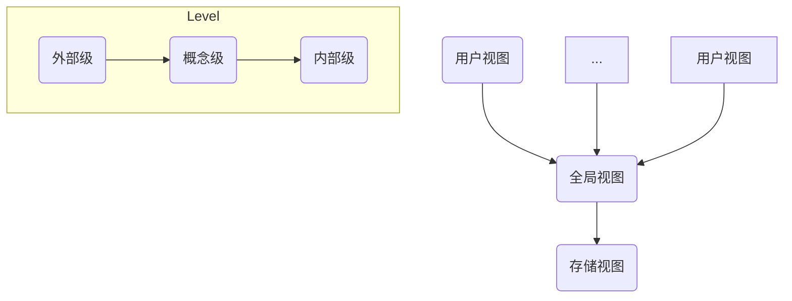
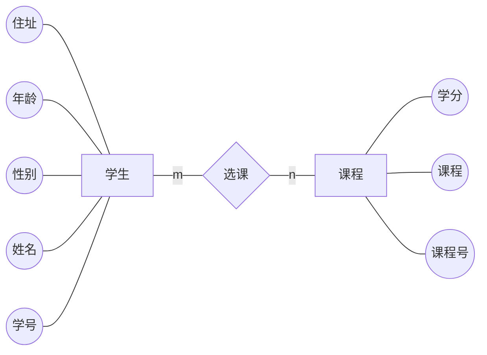
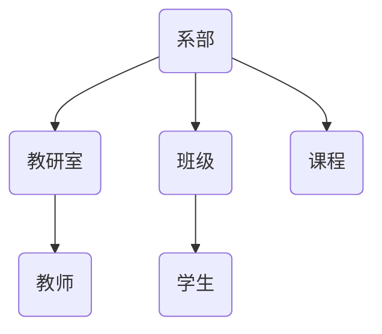
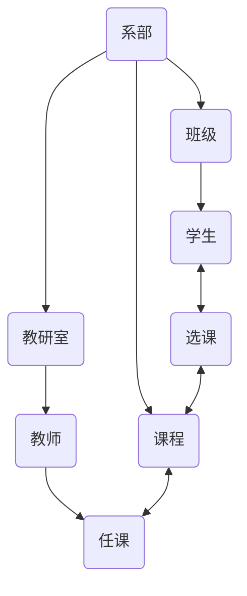

# Chapter1 Basic knowledge

> Before we learn, we need to make a brief introduction to the structure of database, to learn some basic conception like DBS, DBMS, DB.

## 1. Conception 

### 数据

> **数据是反应客观事物属性的记录，是信息的具体表现形式。**人们常用各种各样的物理符号来表示客观事物的特性和特征，这些符号及其组合就是数据。
> 任何事物的属性都是通过数据来表示的，这些数据经过加工成为信息，而信息必须通过数据才能传播，才能对人类产生影响。

### 数据处理

> **数据处理也称为信息处理，就是计算机对数据进行输入、输出、整理、存储、分类、排序、检索、统计等加工过程。**数据处理的对象包括数值、文字、图形、表格等。

### 数据库

> **数据库(DB)就是数据存储的仓库。**数据库由两部分组成：一是应用所需要的数据的集合，成为物理数据库，它是数据库的主体；二是关于各级数据结构的描述，由数据字典系统管理。

### 数据模型

> 为了有效地实现对数据的管理，必须使用一定的结构来组织、存储数据，并且需要一种方法来建立各种类型数据之间的联系。我们把**表示实现类型及实体之间联系的模型称为数据模型**，包括关系模型、层次模型和网状模型等。

### 数据库管理系统

> 数据库管理系统(DBMS)是数据库系统中对数据进行管理的专门的软件系统，它是数据库系统的核心部分，对数据库的所有操作和控制都是通过DBMS来实现的。

### 数据库应用系统

> 数据库应用系统是在某种DBMS的支持下，根据实际应用的需要开发出来的应用程序包。

### 数据库系统

> **数据库系统(DBS)是硬件系统、DB、DBMS、数据库应用系统、数据库管理员和用户的统称。**


## 2. Features

> + 数据共享性高、冗余度小、易扩充；
>
> + 采用特定的数据类型；
>
> + 数据独立性高；
>
> 	数据的独立性包括物理独立性和逻辑独立性。物理独立性指当数据的物理存储改变时，应用程序不用改变。逻辑独立性指当数据的逻辑结构改变时，用户应用程序不用改变。
>
> + 统一的数据管理和控制
>
> 	数据库对于系统中的用户是共享资源的，计算机的共享一般是并发的，甚至可以同时存取数据库的同一个数据。因此数据库管理系统必须提供以下的数据控制保护功能：*数据的安全性保护、数据的完整性保护、数据库恢复、并发控制*。


## 3. Structure

数据库的体系结构分为3级：**外部级（用户视图）、概念级（全局视图）和内部级（存储视图）**。

从不同角度看到的数据特征称为数据视图。用户所看到的数据特征属于外部级，单个用户使用的数据视图称为外模型；而涉及用户的数据定义，也就是全局的数据视图，称为概念模型；涉及实际数据存储方式最接近存储的物理设备的数据视图，称为内模型。




## 4. Data Model

数据模型是用来抽象表示和处理现实世界中的数据和信息的工具，是反映客观事物级客观事物之间联系的数据组织的结构和形式。

在数据库技术中，可用数据模型描述数据的整体结构，包括数据的结构和性质、数据之间的联系、完整性约束及数据变换规则。数据模型应该结构简单，易于在计算机上实现，而且能够比较真实地反映客观事物之间的联系。

数据模型可分为两种形式：**概念模型**和**实现模型**。通常先将现实世界中的一个系统抽象为概念模型，它既不依赖于具体的DBMS，然后把概念模型转换为与某一个具体DBMS相关联的数据模型，即实现模型。在实际生活中，数据模型是指实现模型。

### 4.1 Conception Model

> 概念模型是现实事物之间的一种抽象，它表示数据的逻辑特征，从概念上表示数据库中将要存储的信息，而不涉及这些信息在数据库中的存储形式。最常见的概念模型是实体-联系模型(Entity-Relationship)图，简称E-R图。

#### (1) 实体

实体是指客观存在的并相互区别的事物。

#### (2) 属性

属性是指实体具有的特性。

#### (3) 实体型和实体集

用实体名及其属性名集合来抽象和刻画同类实体，称为实体型。

同类型实体的集合称为实体集。

#### (4) 实体间的联系

实体与实体之间的联系称为实体间的联系。包括一对一联系、一对多联系、多对多联系。

#### (5) 实体-联系模型

实体-联系模型是反映实体之间联系的结构形式，简称E-R模型。描述E-R模型通常用E-R图，E-R图提供了实体型、属性和联系的方法。

E-R图包括以下三个要素：

> + 实体型：用矩形表示，矩形框内写明实体名；
> + 属性：用椭圆形表示，并用直线和相关实体连接；
> + 联系：用菱形表示，框内写明联系名，用直线与相关实体相连，同时著名联系类型。
>



<center />E-R图

### 4.2 实现模型

> **为了反映现实世界中的客观事物本身及其与其他事物之间的联系，数据库中的数据必须具有一定的结构，这种结构就是实现模型，也统称为数据模型（更多叫基本数据模型，与其父类不同）。**数据模型是数据之间逻辑关系的一种反映。

数据模型分为3类：层次模型、网状模型和关系模型。

#### (1) 层次模型

> 层次模型是数据库中最早出现的数据模型，层次数据库系统采用层次模型作为数据的组织方式。用树型（层次）结构表示实体类型及实体间的联系是层次模型的主要特征。

在数据库中，层次模型具有树结构（非线性数据结构）的基本特点，因此层次模型具有层次清楚、结构简单、易于实现，能够描述一对一和一对多的联系。



<center/>层次模型示例

#### (2) 网状模型

在现实世界中事物之间的联系更多的是非层次关系，用层次模型表示非树形结构是很不直接的，网状模型则可以克服这一弊端。

用网状结构表示实体类型及实体之间联系的数据模型称为网状模型。网状模型是层次模型的扩展，表示多个从属关系的层次结构，网状模型的节点间可以任意发生关系，能够表示各种关系。其节点满足以下条件：

> 1）允许节点拥有超过一个父节点；
>
> 2）允许一个以上的节点无父节点（即多个根节点）； 

网状结构可以表示较复杂的数据结构，即可以表示数据间的横向和纵向关系。网状结构可以多用于多对多的联系。




#### (3) 关系模型

关系模型是目前最常用的一种数据模型。关系模型系统采用关系模型作为数据的组织方式。  

现实世界中人们常用表格形式来表示数据信息。但是日常生活中使用的表格往往比较复杂，在关系模型中基本数据结构被限制为二维表格。因此，在关系模型中，数据在用户观点下的逻辑结构就而是一张二维表。每一张二维表都被称为关系。

| 学号    | 姓名   | 性别 |
| ------- | ------ | ---- |
| 1161001 | 李伯任 | 男   |
| 1161002 | 陈晴   | 男   |
| 1161003 | 马大大 | 男   |
| 1161004 | 夏小雪 | 女   |
| 1161005 | 钟大成 | 女   |

<center/>学生表


## 5. Relation Database

### 5.1 Basic Conception

#### (1) 关系

> 一个关系就是一个二维表，每个关系都有一个关系名，常常表现为表的名字。

#### (2) 元组

> 在一个二维表中，表中的行称为元组，每一行都是一个元组（也称为一个实体），元组对应表中的每一条记录。

#### (3) 字段

> 每一列称为一个字段，列首称为字段名，字段名以下的的单元格中的数据称为字段值，同一列的字段值具有相同的属性（即数据格式大小等）。

#### (4) 记录

> 每一行称为一个记录或者一个元组，也就是关系的“值”。同一个记录中的各字段值都是相互有关的。

#### (5) 域

> 属性的取值范围称为域，即不同的元组对同一属性的取值所限定的范围。

#### (6) 属性

> 属性是数据的特性，如类型、长度等。

#### (7) 主键

> 其值能唯一地标识表中每条记录的字段。主键可以是一个字段，也可以是多个字段的组合。
>
> 主键是用于在某个表中域其他表中外键建立关系，快速查找并组合存储在各个表中的信息，进行分类、筛选和统计等。
>
> **在数据库中，主键的值既不允许重复，也不允许空值的存在，而且必须始终有唯一索引。**

#### (8) 外键

> 一个表中的某个（或多个）字段是另一个表的主键，这个字段就被称为外键。外键用于建立表与表之间的关系。


### 5.2 Relation Calculation

> 在关系数据库进行查询时，需要找到用户感兴趣的数据，这就需要对关系进行一定的运算。关系的基本运算有两类：一类是传统的集合运算（并、差、交），另一类是专门的关系运算（选择、投影、连接），有时查询需要几种基本运算的组合。

#### 5.2.1 选择运算

> **从选择中找出满足给定条件的那些元组称为选择。**其中条件是由逻辑表达式给出的，值为真的元组将被选出。这种运算是从水平方向抽取元组。

```SQL
LIST FOR 出版单位=“高等教育出版社” AND 单价 <= 20
```

#### 5.2.2 投影运算

> **从关系模式中挑选若干属性组成新的关系称为投影。**这是从列的角度进行的运算，相当于对关系进行垂直分解。

```SQL
LIST FIELDS 单位，姓名
```

#### 5.2.3 连接运算

> 连接是将两个关系模式通过公共的属性名拼接成一个更宽的关系模式，生成的新关系包含满足连接条件的元组。运算过程是通过连接条件来控制的，连接条件中将出现两个关系中的公共属性名，或者具有相同语义、可比的属性。连接是对关系的结合。

#### 5.2.4 自然连接

> 自然连接是去掉重复属性的等值连接。它属于连接运算中的一个特例，是最常用的连接运算，在关系运算中起着重要作用。


### 5.3 Integrity of the relationship

关系的完整性规则是对关系的某种约束性条件，以保证数据的正确性、有效性和相容性。关系模型中有3类完整性约束：

> + **实体完整性**：实体完整性规则要求关系中的主键不能取空值或重复的值；
> + **参照完整性**：对数据库中建立关联联系的数据表间数据参照引用的约束，也就是对外键的约束。准确地说，指关系中的外键必须是另一个关系的主键有效值。
> + **域完整性**：域是逻辑相关的值的集合，从域中可以得到特定的列的值，域的完整性是指列输入数据的有效性，即输入的数据都应该包含在域内。


## 6. Database Design

概括起来，数据库设计包括两方面：**数据库的结构设计**与**数据库应用系统的功能设计**。（有点像前后端设计）

**数据库的结构设计，就是建立一组结构合理的基表，这个是数据库的数据源。**必须合理地规划，有效地组织数据，以便实现高度的数据集成和有效的数据共享。基表应该满足关系规范化的原则，尽可能减少数据冗余，保证数据的完整性和一致性。

数据库应用功能的设计，是在充分进行用户需求分析的基础上来实现的，它包括各种用户界面的设计和功能的实现策略。

除了必要的硬件选择和建立外，还必须选择一个合适的软件，即DBMS.

### 6.1 Data Normalization

> 数据规范化属于数据库设计理论范畴，此处只做简单介绍。
>
> 在数据库中，基表必须满足规范化的原则，即是一个二维表。对二维表最通俗的解释是，每个字段必须是原子的、不可再分的，每一行就是一个记录，行与行之间不存在组合。
>
> 由于数据之间不同的特点和相互依赖关系，在数据操作时会遇到各种问题。为此，标准的规范化格式分为5种，一般只需要前三种，后两种第五第七范式只有在关系规范化研究较深时才会用到。

#### (1) 第一范式 (1NF)

> 每个字段必须树原子的、不可再分的。这是最基本的要求。

#### (2) 第二范式 (2NF)

> 首先，必须满足第一范式，并且不存在非主键对主键的部分函数依赖。也就是说，所有的非主键都完全函数依赖于主键，不存在只与主键中的部分属性的函数依赖。

#### (3) 第三范式 (3NF)

> 首先，必须满足第二范式，并且不存在非主键对主键的传递函数依赖。也就是说所有的非主键都之间函数依赖于主键，不存在间接地函数依赖于主键。

函数依赖即指主键与非主键之间存在某种直接的关连，可以用函数表征。而传递函数依赖是指主键于非主键之间可以通过第三键相关联，可以用函数表征。

---

###  6.2 Development and design 

> 数据库应用系统的开发与设计使用软件工程的理论与方法作为指导。软件工程把应用系统的开发过程描述为软件生命周期，这个周期分为**用户需求分析、应用系统设计、设计的实现（编码）、应用系统测试、系统运行和系统维护**。

#### 6.2.1 用户需求分析

在整个软件生命周期中，这个阶段是至关重要的，必须充分了解用户的需求，包括业务流程、数据流向等，才能设计出符合客观需要的优秀软件。这要分为以下内容的调查与分析：

##### (1) 业务流程分析

> 充分了解用户的业务流程、业务之间的联系，确定他们之间相互关联的方法，为功能设计建立良好的依据。

##### (2) 数据流向分析

> 充分了解数据的原始来源，中间经过哪些处理环节，它们之间有哪些联系，包括输入输出及反馈等流向，为数据库的设计奠定基础。

##### (3) 系统功能分析

> 通过分析、归纳用户的业务过程，理出各个环节的关系，制定出解决问题的方案，画出 E-R图。

#### 6.2.2 应用系统设计

在完成了需求分析后，就可以进入应用系统设计阶段，它包括以下几个环节：

##### (1) 数据库结构设计

> 数据库结构设计是非常关键的一步，他将决定整个应用系统的数据源的组织、结构是否合理，关系到系统的工作效率和质量。数据库结构设计包括基表的结构设计、建立数据模型以及设计表与表之间的关联方法，设计时要遵循数据规范化的原则。

##### (2) 应用系统的功能设计

> 在这一步的工作中，应根据需求完成各个功能的详细设计，建立各个模块之间的联系方法，按照规范设计。

##### (3) 用户界面设计

> 用户界面设计包括输入模块和输出模块的设计，人机交互界面设计等；
>
> 输入模块要求美观、操作方便，并要保证整体风格同意，输出模块包括显示和打印两个模块的设计，人机交互界面包括流程的控制面板设计和对话框设计。

#### 6.2.3 设计的实现（编码）

编码实现功能，技术上要对可能发生的错误进行防范，提高抗干扰能力，还要增加一些容错技术等。 

#### 6.2.4 应用系统测试

对软件的测试首先要完成对单个模块的测试，然后进行多个模块之间的整体连调，包括功能的测试和性能的测试。

#### 6.2.5 系统运行和系统维护

测试完毕后就可以进行投入试运行了，但不代表没有问题，任何一个优秀的软件都是在不断的运行中不断发现问题、解决问题、克服不足、逐渐完善的，这是一个必不可少的过程。


# Chapter2 Access Synopsis

## 1. Database Object

在Access2010中，**数据库包括6个基本对象，即表、查询、窗体、报表、宏、模块。**

每个对象在数据库中国的作用和功能也不同。当打开一个数据库时，数据库的所有对象都可以在导航窗格显示出来。所有数据库对象都保存在扩展名为 `.accdb` 的同一个数据库文件中。

> ***注：Access语句对大小写不敏感。***

### 表

> 表也称为基表，它是数据库中最基本的数据源，是信息的仓库，是信息数据处理的基础和依据。一个数据库可以包含多个表，每个表都是由规范化的数据以一定的结构组织起来的，且表与表之间既有独立性，又存在一定的联系，可以通过某种方式定义它们之间的关系。

### 查询

> 查询时对基表数据有选择地提取而产生的另一类的对象，以便提高数据处理的效率。一个查询产生的结果可以是另一个表中的部分字段信息，数据库操作中称为"投影"；也可以是表中满足条件的部分记录，数据库操作中称为“筛选”；还可以是来自多个表的部分或全部信息，数据库中操作称为“连接”。查询不仅可以根据需要选择基表中的数据，还可以根据需要进行排序、统计、计算等操作。因此，查询可以方便用户，提高数据处理的效率。
>
> 这种查询属于对表得信息检索的类型，它的特点是不改变原表中的原始数据。另一类查询称为“操作查询”，它包括“删除”、“更新”、“生成表”等操作，此类查询操作会导致原始表数据发生变化。

### 窗体

> 窗体是重要的人机交互界面，是用户和 Access 之间的接口。设计者可以利用窗体为用户提供友好的界面，供用户浏览和修改表中的数据。由于 Access 的窗体设计非常方便灵活，因此设计者可以充分发挥之间的创意，展现自己的个性和才华，使得 Access 应用体系具有独有的整体风格，既接近实际应用又高于实际应用，使用户能够轻松愉快、方便快捷地对数据库进行各种操作。

### 报表

> 报表是 Access 提供的另一种输出形式，主要作用是从打印机上输出。一般来说，对数据库信息的输出，如果只需要查看内容或计算结果，使用窗体就可以了。如果要打印出各种表格，并对数据进行分类、分组等处理，使用报表是最好的选择。
>
> 报表的数据源来自表或查询，报表中数据的计算非常方便，Access 提供了丰富的函数，包括各种日期函数、页统计、统计函数等，这些函数的计算值都被存储在报表对象中。

### 宏

> 宏是命令的集合。命令实际上是一段简单的小程序，每个命令实现一个特定的操作。Access 提供了40多种宏命令。Access 宏可以只包括一个宏命令，也可以包括多个宏命令，还可以根据条件执行其中的某些宏命令，但是宏只能用于执行一些简单的操作，不能处理复杂的过程。

### 模块

> 模块也称程序，是比宏更大更复杂的程序。它能够处理更多的事务，处理各种复杂情况和执行相应的过程。随着数据库中数据量的不断增加，用户对管理信息系统的要求越来越高，仅仅靠宏命令是远远不够的，要编制出高质量的功能强大的应用程序，必须使用模块来实现。
>
> Access 中嵌入了数据库编程语言 VBA ，也可以外挂动态网页动态设计语言 ASP。模块中的每一个过程都可以是一个函数过程或者子程序。 
>


## 2. Create Database

在 Access 中创建数据库通常有两种方法：一种是利用 Access 向导创建数据库，另一种是直接创建空数据库。具体的省略。


# Chapter3 Data Sheet

> 在建立数据库的基础上，本章主要介绍数据库中数据表的创建和编辑方法、记录的输入操作、常用字段属性的设置、数据的排序和筛选、表与表之间的关系等。

## 1. Create

> 表在数据库中用来存储数据的对象，是整个数据库的基础，也是数据库中其他对象的数据来源。

## 2. Data type

| 数据类型  | 说明                                                         |
| --------- | ------------------------------------------------------------ |
| 文本      | 这种类型允许最大**255**个字符或数字，即120多个汉字，可以对文本字段进行排序和索引。 |
| 备注      | 这种类型用来保存长度较长的文本及数字，它允许字段能够存储长达65535个字符的内容。**但 Access *不能对备注字段进行排序或索引*，却在备注字段中虽然可以搜索文本，但却不如在有索引的文本字段中搜索得快。** |
| 数字      | 这种字段类型可以用来存储进行算术计算的数字数据.用户还可以设置“字段大小”属性定义一个特定的数字类型，任何指定为数字数据类型的字型可以设置成“字节”、“整数”、“长整数”、“单精度数”、“双精度数”、“同步复制ID”、“小数”五种类型。在Access中通常默认为“双精度数”。 |
| 日期/时间 | 这种类型是用来存储日期、时间或日期时间一起的，每个日期/时间字段需要**8**个字节来存储空间。 |
| 货币      | 这种类型是数字数据类型的特殊类型，**等价于具有*双精度属性*的数字字段类型**。向货币字段输入数据时，不必键入人民币符号和千位处的逗号，Access会自动显示人民币符号和逗号，并添加两位小数到货币字段。*当小数部分多于两位时，Access会对数据进行四舍五入。* |
| 自动编号  | 这种类型较为特殊，每次向表格添加新记录时，Access会自动插入唯一顺序或者随机编号，即在自动编号字段中指定某一数值。自动编号一旦被指定，就会永久地与记录连接。如果删除了表格中含有自动编号字段的一个记录后，Access并不会为表格自动编号字段重新编号。**当添加某一记录时，Access不再使用已被删除的自动编号字段的数值，而是重新按递增的规律重新赋值。** |
| 是/否     | 这种字段是针对于某一字段中只包含两个不同的可选值而设立的字段，通过是/否数据类型的格式特性，用户可以对是/否字段进行选择。 |
| OLE对象   | 这个字段是指字段允许单独地“链接”或“嵌入”OLE对象。添加数据到OLE对象字段时，可以链接或嵌入Access表中的OLE对象是指在其他使用OLE协议程序创建的对象。OLE对象字段最大可为1GB，它主要受磁盘空间限制。 |
| 超级链接  | 这个字段主要是用来保存超级链接的，包含作为超级链接地址的文本或以文本形式存储的字符与数字的组合。当单击一个超级链接时，WEB浏览器或Access将根据超级链接地址到达指定的目标。超级链接最多可包含三部分：一是在字段或控件中显示的文本；二是到文件或页面的路径；三是在文件或页面中的地址。在这个字段或控件中插入超级链接地址最简单的方法就是在“插入”菜单中单击“超级链接”命令。 |
| 查阅向导  | 这个字段类型为用户提供了一个建立字段内容的列表，可以在列表中选择所列内容作为添入字段的内容。 |

### Float and Int

| **数字** | **说明**                                                     | **小数精度** | **存储空间大小** |
| -------- | ------------------------------------------------------------ | ------------ | :--------------- |
| **字节** | 存储 0 到 255 之间的整数。                                   | 无           | 1 个字节         |
| 整型     | 存储 $ \pm2^{15} $ 之间的整数                                | 无           | 2 个字节         |
| 长整型   | （默认）存储 $ \pm2^{31} $ 之间的整数                        | 无           | 4 个字节         |
| 小数型   | 存储 $–10^{38}$ 到 $10^{38}$ 之间的数字 (.adp)<br />存储 $–10^{28}$ 到 $10^{28}$ 之间的数字（.mdb、.accdb） | 28           | 2 个字节         |
| 单精度型 | 存储 $–3.402823e^{38}$ 到 $3.402823e^{38}$ 之间的数。        | 7            | 4 个字节         |
| 双精度型 | 存储 $–1.797e^{308}$ 到 $1.797e^{308}$ 之间的正数。          | 15           | 8 个字节         |
> **注意：字节型而不是小整数，更不是字符。**


## 3. Tuple attribute

| Attr     | Description                                                  |
| -------- | ------------------------------------------------------------ |
| 字段大小 | 数据最大长度                                                 |
| 格式     | 用于自定义文本、数据、日期和时间类型字段的输出格式           |
| 输入掩码 | 输入数据格式化，具体的格式符如下，可用于数字、货币、日期/时间以及（短）文本。 |
| 标题     | 窗体显示文本，若无，则显示为字段名。                         |
| 默认值   | 默认值是新增记录时该字段的默认内容，以减少输入量，同时默认值是可修改的 |
| 验证规则 | 用于指定对输入的要求                                         |
| 验证文本 | 当输入数据不满足验证规则时弹出的窗体文本信息                 |
| 必需     | 是否是必须填写的属性                                         |
| 索引     | 索引可以加速对索引字段的查询，还能加速排序以及分组操作       |
| 文本对齐 | 文本对齐方式                                                 |


## 4. Input mask

输入掩码格式符：

| **字符**    | **说明**                                                     |
| ----------- | ------------------------------------------------------------ |
| 0           | 用户必须输入一个数字（0 到 9）。                             |
| 9           | 用户可以输入一个数字（0 到 9）。                             |
| #           | 用户可以输入一个数字、空格、加号或减号。 如果跳过，Access 会输入一个空格。 |
| L           | 用户必须输入一个字母。                                       |
| ?           | 用户可以输入一个字母。                                       |
| A           | 用户必须输入一个字母或数字。                                 |
| a           | 用户可以输入一个字母或数字。                                 |
| &           | 用户必须输入一个字符或空格。                                 |
| C           | 用户可以输入字符或空格。                                     |
| . , : ; - / | 小数分隔符、千位分隔符、日期分隔符和时间分隔符。 您选择的字符取决于 Microsoft Windows 区域设置。 |
| >           | 其后的所有字符都以大写字母显示。                             |
| <           | 其后的所有字符都以小写字母显示。                             |
| !           | 导致从左到右（而非从右到左）填充输入掩码。                   |
| \           | 逐字显示紧随其后的字符。                                     |
| ""          | 逐字显示括在双引号中的字符。                                 |

## 附：ANSI-89 通配符

使用“**查找和替换**”对话框查找并根据需要替换 Access 数据库或 Access 项目中的数据时，使用此通配符集。 还可以在对 Access 数据库运行选择和更新查询时使用这些通配符，但不能用于对 Access 项目运行查询。

| **字符** | **说明**                                                    | **示例**                                |
| -------- | ----------------------------------------------------------- | --------------------------------------- |
| *        | 匹配任意字符数                                              | “**wh\***”将找到 what、white            |
| ?        | 匹配任意单个字母字符                                        | “**B?ll**”可以找到 ball、bell 和 bill。 |
| [ ]      | 匹配括号中的任意单个字符                                    | “**B[ae]ll**”可以找到 ball 和 bell      |
| !        | 匹配括号中不包含的任意字符                                  | “**b[!ae]ll**”可以找到 bill 和 bull     |
| -        | 匹配字符范围中的任意一个字符。 <br />但必须以升序指定该范围 | “**b[a-c]d**”将找到 bad、bbd 和 bcd     |
| #        | 匹配任意单个数字字符                                        | “**1#3**”将找到 103、113 和 123         |

> ***注：不同于标准的正则表达式通配符。***


## 4. Select 

> 筛选是选择查看记录，不改变原始数据。筛选时用户必须设定筛选条件，然后 Access 显示满足条件的数据，不满足条件的数据将被隐藏。筛选可以使得数据更加便于管理。Access提供了三种筛选发生：选择筛选、按窗体筛选和高级筛选。

### 4.1 Select filter

> 选择筛选用于查找**某一个字段**满足条件的数据记录，条件包括“（不）等于”和“（不）包含”等，其作用是隐藏不满足条件的记录，显示所有满足条件的记录。

选择筛选可以直接再开始选项版筛选工具栏中选择功能直接使用。

### 4.2 Form select

> 按窗体筛选是在空白窗体中设置筛选条件，然后查找满足条件的所有记录并显示，可以在窗体中设置**多个条件**，按窗体筛选是使用最广泛的一种筛选方法。

### 4.3 Advanced select

> 高级筛选不仅可以筛选满足条件的记录，还可以对筛选结果进行**排序**。


## 5. Index

索引可以**加速**对索引字段的**查询**，还能加速排序集分组操作。当表数据量很大时，为了提高查找速度，可以设置索引属性。索引属性有以下3个项选取：

> + “无”：表示本字段无索引，且改字段的记录可以重复；
> + “有（有重复）”：表示本字段有索引，且该字段中的记录可以重复；
> + “有（无重复）”：表示本字段有索引，且该字段中的记录不允许重复；
>

一般情况下，作为主键字段的索引属性为“有（无重复）”，其他字段的索引属性为“无”。

# Chapter4 Query

> 查询时基于“表”的一种视图，通过查询所看到的记录，实际上是存储在表中的数据，不需要额外的空间来存储他们，而只是对它们进行重新组合、聚集、统计的加工处理后得到的另一种视图。利用查询可以实现对数据库中的数据进行浏览、筛选、排序、检索、统计等加工操作。

## 1. Synopsis

利用数据表可以存储数据，这些数据可以长期保存于数据库中。存储数据时为了重复使用这些数据。在设计数据库时，为了减少数据冗余，节省内存空间，常常会将数据分类存储到多个数据表中，这种设计导致某些相关信息分散地存储在多个数据表中。在使用这些数据时，用户可以根据自己的需求从单个数据表中获取需要的数据，也可以从多个相关的数据表中获取信息，这是所要采用的功能就是查询功能。

### 1.1 Conception

查询是指向数据库提出请求，使数据库按照特定的需求在指定的数据源中进行查找，以提取特定的字段，***返回一个新的数据对象***，这个对象就是查询结果。查询是数据库中的一个重要对象，具有以下功能：

> *(1) 选择字段和记录;* 查询可以根据给定的条件查找并显示相应的记录，也可以仅显示需要的字段；
>
> *(2) 修改记录；* 通过查询功能可以对符合条件得记录进行添加、修改、删除等操作；
>
> *(3) 统计和计算；* 可以使用查询对数据进行统计和计算；
>
> *(4) 建立新表；* 可以将查询所得得动态记录存储于表中；
>
> *(5) 为其他数据库对象提供数据源；* 在创建报表、窗体或数据访问页时，其数据源可能时多个表，在这种情况下，可以先建立一个查询，再以查询作为一个数据源设计报表等；

> **Tip：**查询与筛选不同，筛选可能会返回一个窗体对象，而查询返回一个查询对象。

---

### 1.2 Type

根据对数据源的操作方式以及查询结果，Access 2010 提供的查询可以分为5中类型，分别是选择查询、交叉表查询、参数查询、操作查询和 SQL 查询。

> #### (1) 选择查询
>
> 选择查询是最常见的查询类型，它能根据用户指定的查询条件，从一个或多个数据表中获取数据并显示结果，还可以利用查询条件对记录进行分组，并进行求和、计数、平均数等运算。选择查询产生的结果是一个动态记录集，不会改变数据表中的数据。
>
> #### (2) 交叉表查询
>
> 交叉表查询可以计算并重新组织数据表的结构，可以方便地分析数据。交叉表查询将源数据或查询中的数据分组，一组在数据表的左边，另一组在数据表的上部，数据表内行与列的交叉单元格处显示表中数据中的某个统计值，这是一种可以将表的数据看成字段的查询方。
>
> #### (3) 参数查询
>
> 参数查询为用户提供了 更加灵活的查询方式，可以通过参数来设计查询的准则，在执行查询时，会出现一个已经设计好的对话框，由用户输入查询条件并根据此条件返回查询结果。
>
> #### (4) 操作查询
>
> 操作查询是指在查询中对源数据表进行操作，可以对表中的记录进行追加、修改、删除和更新操纵，操作查询包括删除查询、更新查询、追加查询和生成表查询。 
>
> #### (5) SQL查询
>
> SQL 查询是指使用结构化查询语言 SQL 创建的查询。 在 Access 种用户可以使用查询设计器创建查询，在查询创建完成后，系统会自动生成一个对应的 SQL 语句，除此之外，用户还可以使用 SQL 语句创建查询，实现对数据的查询和更新操作。

---

### 1.3 Query View

查询一共有五种视图，分别是设计视图、数据表视图、SQL 视图、数据透视表视图和数据透视图视图。

> + **设计视图**：查询设计器，通过该视图可以创建除 SQL 之外的各种类型查询；
> + **数据表视图**：数据表视图是查询数据浏览器，用于查看查询运行结果；
> + **SQL 视图**：SQL 视图时查看和编辑 SQL 语句的窗口，通过该窗口可以查看用查询设计器创建的的查询所产生的 SQL 语句，也可以对 SQL 语句进行编辑和修改。
>
> + **数据透视表视图和数据透视图视图**：在数据透视表视图和数据透视图视图种，可以根据需要生成数据透视表和数据透视图从而对数据进行分析，得到直观的分析结果。
>

---
### 1.4 Create

在 Access 中，创建查询的方法主要有两种，有使用查询设计视图创建查询和使用查询向导创建查询。

> (1) **使用查询设计视图**：打开创建选项卡，查询工具栏，选择查询设计功能，然后根据需要进行查询创建； 
>
> (2) **使用查询向导**：同上，创建查询向导，然后根据系统的引导完成创建；
>


## 2. Select filter

